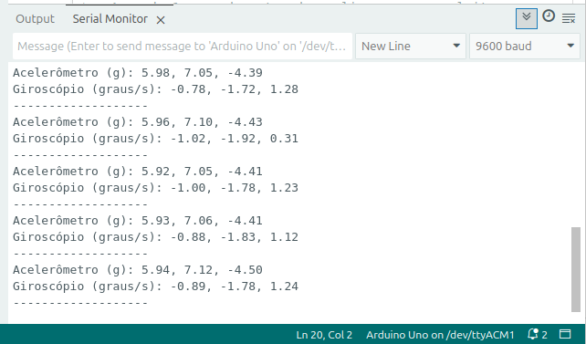
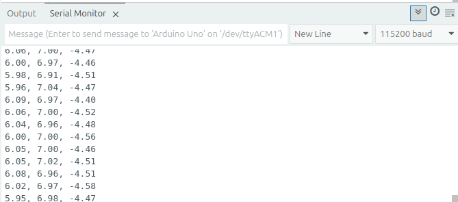
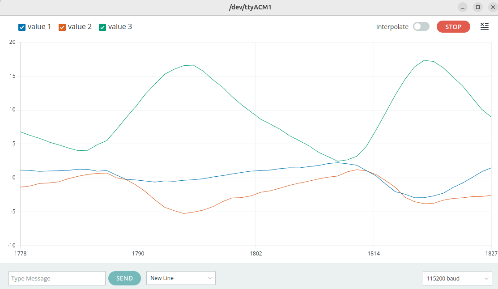

# **Roteiro de Laboratório: Leitura e Serialização de Dados do MPU-6050**

## **Objetivo**

Este roteiro tem dois objetivos principais:

1. **Leitura Básica:** Realizar a leitura dos dados de aceleração e giroscópio de um sensor MPU-6050 com o Arduino.  
2. **Serialização de Dados:** Modificar o código para formatar (serializar) a saída dos dados em um protocolo simples, preparando-os para serem usados por aplicações externas, como modelos de aprendizado de máquina.

---

## **Parte 1: Comunicação Básica com o Sensor**

O código abaixo demonstra a leitura fundamental dos eixos do acelerômetro e do giroscópio do MPU-6050.

**Instruções:**

1. Carregue o [script](./leitura_basica/leitura_basica.ino) no seu Arduino UNO.  
2. Abra o Monitor Serial do Arduino IDE com a taxa de 9600 bps.  
3. Observe os dados sendo impressos.

```arduino
#include <Wire.h>
#include <MPU6050.h> // Biblioteca para comunicação com o sensor MPU6050

#define CONVERT_G_TO_MS2    9.80665f // Fator de conversão de 'g' para m/s²

MPU6050 mpu; // Instância do objeto MPU6050 para acessar o sensor

/**
 * Função de configuração inicial do Arduino.
 * 
 * - Inicializa a comunicação serial para envio dos dados ao computador.
 * - Inicializa a comunicação I2C (Wire) para comunicação com o sensor MPU6050.
 * - Inicializa o sensor MPU6050.
 */
void setup() {
  Serial.begin(9600); // Inicializa a comunicação serial a 9600 bps
  Wire.begin();       // Inicializa a comunicação I2C
  mpu.initialize();   // Inicializa o sensor MPU6050
} 
 

/**
 * Loop principal do Arduino para leitura dos dados do acelerômetro e giroscópio via MPU.
 * 
 * - Lê os valores brutos dos sensores (ax, ay, az para acelerômetro; gx, gy, gz para giroscópio).
 * - Converte os valores do acelerômetro para unidades de gravidade (g) e depois para m/s².
 * - Converte os valores do giroscópio para graus por segundo.
 * - Imprime os valores convertidos no monitor serial, organizando por tipo de sensor.
 * - Aguarda 1 segundo antes de realizar uma nova leitura.
 */
void loop() {
  // Ler os dados do acelerômetro e giroscópio
  int16_t ax, ay, az, gx, gy, gz;
  mpu.getMotion6(&ax, &ay, &az, &gx, &gy, &gz);
  
  // Converter valores brutos do acelerômetro para 'g' e depois para m/s²
  float accelX_g = ax / 16384.0; // valor em múltiplos de g
  float accelY_g = ay / 16384.0;
  float accelZ_g = az / 16384.0;
  float accelX = accelX_g * CONVERT_G_TO_MS2; // valor em m/s²
  float accelY = accelY_g * CONVERT_G_TO_MS2;
  float accelZ = accelZ_g * CONVERT_G_TO_MS2;

  // Converter valores brutos do giroscópio para graus por segundo
  float gyroX = gx / 131.0;   // valor em graus/s
  float gyroY = gy / 131.0;
  float gyroZ = gz / 131.0;

  // Imprimir os valores convertidos no monitor serial
  Serial.print("Acelerômetro (g): ");
  Serial.print(accelX);
  Serial.print(", ");
  Serial.print(accelY);
  Serial.print(", ");
  Serial.println(accelZ);
  
  Serial.print("Giroscópio (graus/s): ");
  Serial.print(gyroX);
  Serial.print(", ");
  Serial.print(gyroY);
  Serial.print(", ");
  Serial.println(gyroZ);
  
  Serial.println("-------------------");
  
  delay(1000); // Aguarda 1 segundo antes da próxima leitura
}
```

### **Saída Esperada no Monitor Serial**

Clique o `Serial Monitor` no canto superior direito da Arduino IDE que é bem assim:


A saída será um texto descritivo, que facilita a leitura humana, conforme exemplo da figura abaixo.




---

## **Parte 2: Serialização dos Dados**

Modelos de aprendizado de máquina em sistemas embarcados tem capacidade de processamento limitada e, via de regra, não foram projetados para interpretar um texto descritivo como o da saída anterior. Eles precisam dos dados em um formato bruto e consistente. O processo de converter os dados dos sensores para esse formato é chamado de **serialização**.

### **Requisitos de Formatação (Protocolo)**

O dispositivo deve enviar os dados do **acelerômetro** seguindo estritamente estas regras:

1. A taxa de transmissão serial (baud rate) deve ser **115200 bps**.  
2. Cada leitura dos 3 eixos deve ser enviada em uma **única linha**.  
3. Os valores de cada eixo (x, y, z) devem ser separados por uma **vírgula (,)**.  
4. A linha **não** deve conter textos, espaços ou outros caracteres além dos valores e das vírgulas.
5. A taxa de amostragem deve ser de aproximadamente 62,5 Hz.

**Exemplo de Saída Serial Válida:**
Para observar os seus resultados, ative novamente o `Serial Monitor`.
Agora a saída deve ter formatação semelhante ao exemplo abaixo:



## **Sua Tarefa**

**Modifique o código da Parte 1 para que a saída serial siga estritamente os requisitos do protocolo.**

Quando tiver concluído você pode acompanhar a plotagem dos dados serializados coletados do sensor pelo Arduino. Para isso ative o `Serial Plotter` clicando no ícone que também fica no canto superior direito:


O seu resultado será exibido com um aspecto semelhante ao da figura abaixo:




**Dicas:**

* Altere a taxa de transmissão em `Serial.begin`().  
* Remova todos os `Serial.print()` que imprimem texto (ex: "Acelerômetro (m/s²): ").  
* Envie apenas os dados do acelerômetro (accelX, accelY, accelZ).  
* Use `Serial.print()` para os dois primeiros valores e `Serial.println()` para o último, garantindo a quebra de linha no final.  
* Ajuste ou remova o delay(1000) para gerar dados com mais frequência, conforme requerido por sua aplicação final.