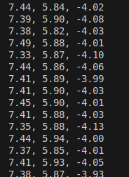

# **Roteiro de Laboratório: Comunicação básica de seu computador com o Arduino**

## **1\. Objetivo**

O objetivo desta etapa é desenvolver e executar um script em Python para ler e exibir os dados de aceleração que estão sendo enviados pelo Arduino via porta serial. Isso validará a comunicação entre o hardware (Arduino) e o software no computador.

## **2\. Pré-requisitos**

1. **Python 3 instalado** em seu computador.  
2. **Biblioteca pyserial instalada.**
3. **Arduino conectado** ao computador via USB.  
4. **Código do Roteiro Anterior:** O Arduino deve estar executando o script desenvolvido no laboratório "[Serialização dos dados do sensor MPU-6050](https://www.google.com/search?q=../arduino_imu_comm/arduino_imu_comm.md)", que envia os dados do acelerômetro no formato x,y,z pela serial.

---
## **3\. Instruções Passo a Passo**
### **Passo 1: Identificar a Porta Serial do Arduino**

Antes de executar o script, você precisa saber em qual porta seu Arduino está conectado.

* **Em Linux ou macOS:** Abra o terminal e execute um dos comandos abaixo. Geralmente a porta se chama ttyACM\* ou ttyUSB\*.  
  ```bash  
  ls dev/ttyACM*  
  # ou  
  ls dev/ttyUSB*
  ```

### **Passo 2: Criar e Configurar o Script Python**

1. Crie um arquivo chamado leitor\_serial.py.  
2. Copie e cole o código-fonte abaixo no arquivo.  
3. **Ajuste a variável PORTA\_SERIAL** no início do código com o nome da porta que você identificou no passo anterior.

---

#### **4\. Código-Fonte Exemplo (leitor\_serial.py)**

Este código foi otimizado para maior clareza e robustez.

```python
import serial
import sys

# --- Constantes de Configuração ---
SERIAL_PORT = '/dev/ttyACM0'  # Altere para a porta correta
BAUD_RATE = 115200

def main():
    """
    Função principal: conecta-se à porta serial e lê os dados brutos continuamente.
    """
    print("Iniciando Passo 1: Leitura Básica de Dados...")

    try:
        # O 'with' garante que a porta serial seja aberta e fechada automaticamente.
        with serial.Serial(SERIAL_PORT, BAUD_RATE, timeout=1) as ser:
            print(f"Porta serial '{SERIAL_PORT}' aberta com sucesso.")
            ser.flushInput() # Limpa o buffer de entrada para começar do zero.

            while True:
                # Lê uma linha de bytes, decodifica para string e remove espaços.
                line_str = ser.readline().decode('utf-8').strip()
                
                # Exibe a linha somente se ela não estiver vazia.
                if line_str:
                    print(f"Recebido: {line_str}")

    except serial.SerialException as e:
        print(f"Erro crítico: Não foi possível abrir a porta serial '{SERIAL_PORT}'.")
        print(f"Detalhes: {e}")
        sys.exit(1)
    except KeyboardInterrupt:
        print("\nPrograma encerrado pelo usuário.")
    finally:
        print("Finalizando o programa.")

if __name__ == "__main__":
    main()

```
### **Passo 3: Executar o Script**

Abra um terminal na pasta onde você salvou o arquivo leitor\_serial.py e execute o comando:

```bash
python leitor\_serial.py
```
---

#### **5\. Resultado Esperado**

Se tudo estiver configurado corretamente, o terminal começará a exibir o fluxo de dados enviados pelo Arduino, com cada linha contendo os três valores de aceleração (X, Y, Z) separados por vírgula, conforme ilustrado na figura abaixo:


