# Instalação do Sistema Operacional do Raspberry Pi(RPi)

O Raspberry Pi(RPi) precisa de um sistema operacional para funcionar: o [**Raspberry Pi OS**](https://www.raspberrypi.com/software/) (anteriormente chamado de Raspbian). Diversas versões do OS estão disponíveis em [https://downloads.raspberrypi.org/raspios_armhf/images/](https://downloads.raspberrypi.org/raspios_armhf/images/). Durante a atualização desse tutorial a versão mais recente era a **Raspberry Pi OS (Legacy) - 32-bit** (baseada no Debian Bullseye) disponível em [https://downloads.raspberrypi.org/raspios_armhf/images/raspios_armhf-2025-05-13/](https://downloads.raspberrypi.org/raspios_armhf/images/raspios_armhf-2025-05-13/). 


## Instalação do Raspberry Pi Imager

* Siga as instruções para instalação do *Raspberry Pi Imager*(`rpi-mager`) que você encontra no  [**site Raspberry Pi software**](https://www.raspberrypi.com/software/) . O **rpi-mager** é a maneira rápida e fácil de instalar o **Raspberry Pi OS** e outros sistemas operacionais em um cartão microSD. Para instalar o Raspberry Pi Imager digite a seguinte linha de comando no terminal:

``` bash
sudo apt update
sudo apt install rpi-imager
```

 ## Instalação do Raspberry Pi OS

* Insira um cartão SD no leitor do computador pessoal (ainda não é pra inserir no RPi) Abra a aplicação **Imager** no menu de aplicativos do Ubuntu:  
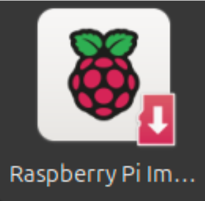

* Formate o cartão SD antes de instalar o sistema operacional selecionando a opção `Erase-Format card as FAT32`

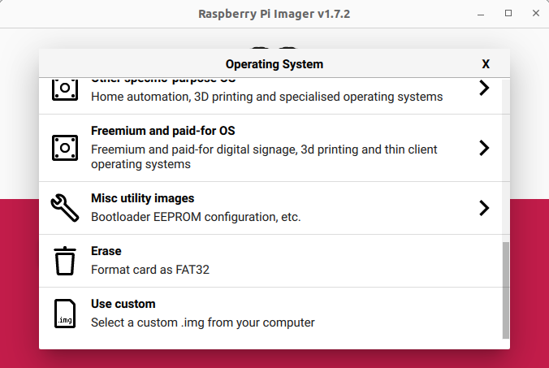
* Clique no botão **Choose Storage**  e selecione a unidade referente ao cartão SD. Depois clique em `Write` e `Yes`.

* Em **Rapsberry Pi Device**, escolha **Raspberry Pi 3**. Em **Operating System** escolha a opção **Raspiberry Pi OS (Legacy, 32-bit)** **\- A port of Debian Bullseye with the Raspberry pi and desktop environment**.

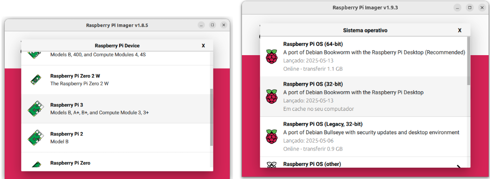

* Clique no botão **Choose Storage**  e selecione a unidade referente ao cartão SD

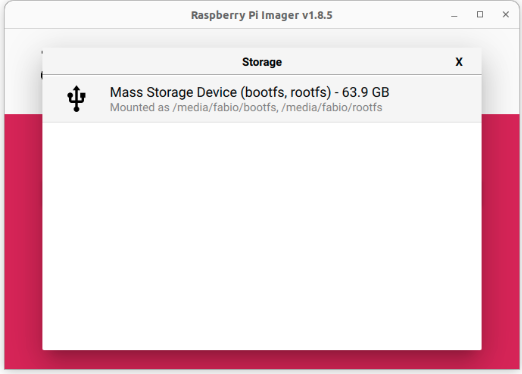

* Clique no botão **Next**

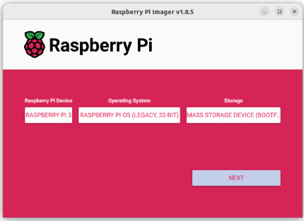

*  Clique em **EDIT SETTINGS**

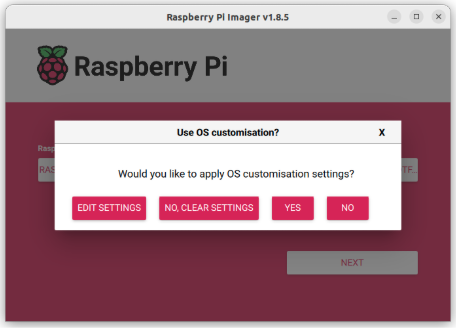

* Selecione as opções conforme a seguir na aba **GENERAL**:  
  * *Set hostname*(nome de anfitrião):   
    * Defina o hostname conforme a sua bancada. Por exemplo, para a bancada 1 o hostname será **rpi1**, para a bancada 2 será **rpi2**.  
  * *Set username and password*(nome de utilizador e palavra-chave)*:*  
    *  Username: **pi**  
    * Password: **pi**  
  * Configure wireless LAN:  
    * SSID: **LabSEA 2.4GHz**  
    * Password:  
  * *Set locale settings*(Definições de idioma e região):  
    * Time zone: America/Sao\_Paulo  
    * Keyboard layout: br

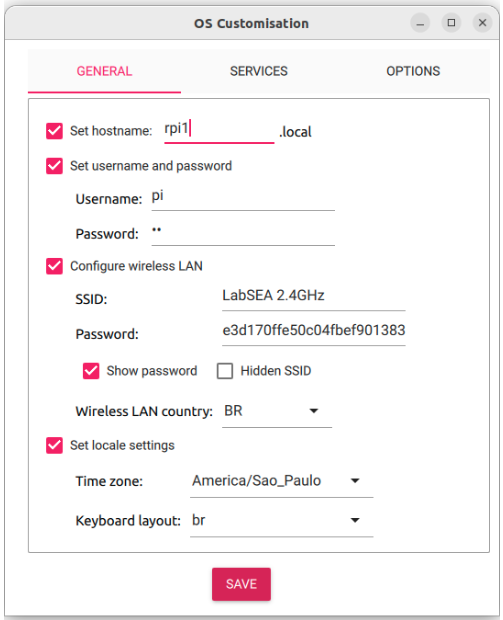

* Na aba **SERVICES**:  
  * Habilite o SSH clicando em *Enable SSH* e clique em *SAVE* para salvar as configurações.

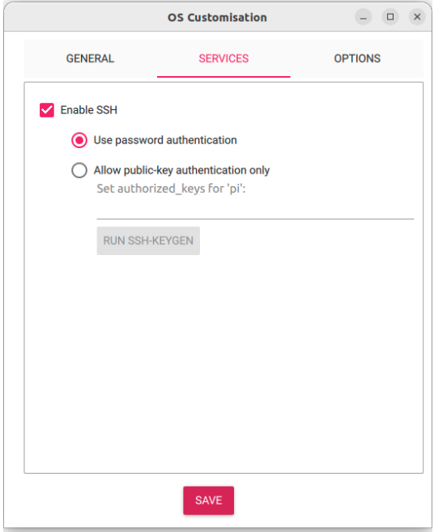

* E, finalmente, inicie a gravação do cartão SD clicando no botão **YES** em duas telas seguidas. 

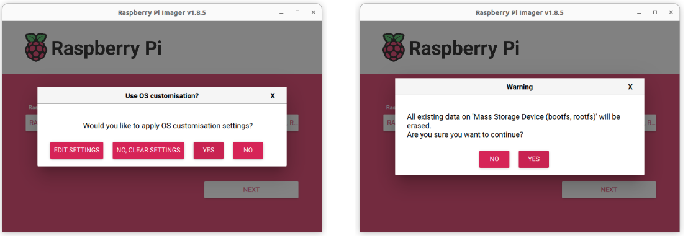

* A senha é solicitada, e começa o processo de instalação. Isso deve demorar alguns minutos **(paciência…)**.

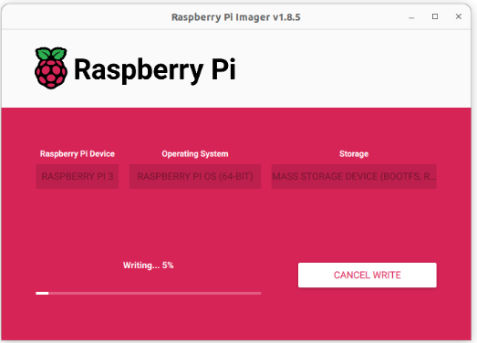

* Quando a instalação é concluída clique em CONTINUAR e remova o cartão SD.

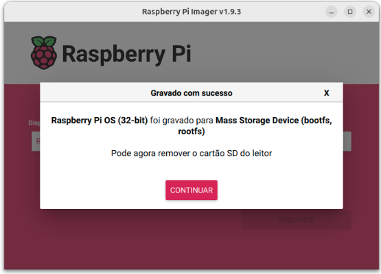

## Configuração de acesso remoto

### Habilitar o servidor VNC no RPi

* Insira o cartão SD no Raspberry Pi 3:

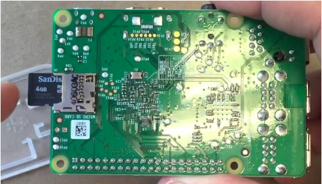

* Conecte a fonte ao conector indicado na figura abaixo:

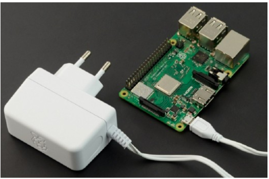

* Abra o terminal clicando em “**Mostrar aplicativos**” no canto inferior esquerdo e abra o “Terminal”.

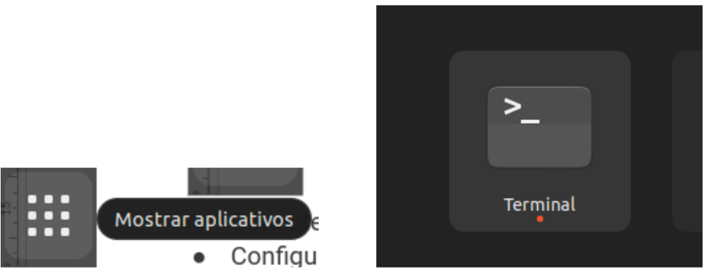

* No terminal digite, substituindo **\<hostname\>** pelo nome de acordo com sua bancada (para a bancada 1, por exemplo, seria rpi1) 

```bash
ssh pi@<hostname>.local
```

* Responda “yes” se surgir um texto lhe perguntando:

```bash
This key is not known by any other names Are you sure you want to continue connecting (yes/no/[fingerprint])? |
```

* Em seguida forneça a senha `pi` cadastrada no `rpi-mager`:

```bash
pi@<hostname>.local's password:
```

* Em seguida você verá o prompt do terminal parecido com a figura abaixo, indicando que você está conectado com o usuário “pi” no host “rpi1”(o número final depende de seu hostname) :

```bash
pi@rpi1:\~ $
```

* No terminal do RPi digite  sudo raspi-config e na opção 3 Interfacing Options-\>I 3 VNC habilite o servidor VNC.

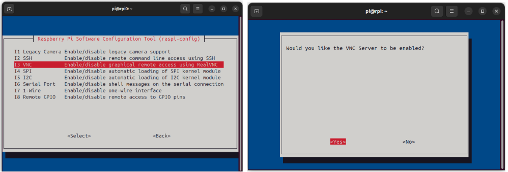

* Saia do raspi-config  e reinicie o RPi com a seguinte linha de comando:

```bash
sudo reboot
```
### Instalação do cliente VNC no computador

* Baixe o VNC viewer: [https://www.realvnc.com/pt/connect/download/viewer/linux/](https://www.realvnc.com/pt/connect/download/viewer/linux/)  
* Instale o VNC viewer com a seguinte linha de comando, substituindo o texto \<VERSÃO DO VNC\> que você baixou(quanto esse tutorial foi escrito era 7.12.1):

```bash
sudo dpkg -i VNC-Viewer-<VERSÃO DO VNC>-Linux-x64.deb
```

* Executar o VNC viewer e se conecte em `<hostname>.local`:

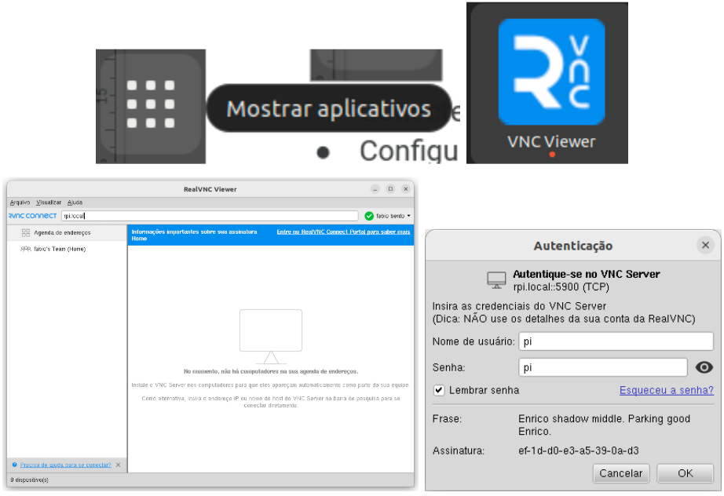

* Agora você tem acesso ao RPi através do monitor de seu computador desktop, sem precisar conectar mouse ou teclado no RPi:

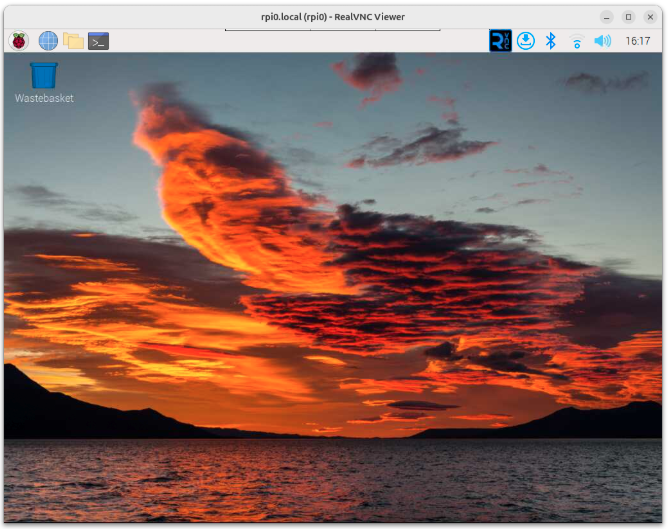

## Configuração do módulo de câmera

* Nesse curso utilizaremos o [módulo de  câmera 2 do Raspberry Pi](https://www.raspberrypi.com/products/camera-module-v2/).  
* Para conectar o módulo de câmera no RPi, desligue o RPi e siga a seção “**Conectar o Módulo de Câmera**” do tutorial disponível **[neste link](https://projects.raspberrypi.org/pt-BR/projects/getting-started-with-picamera/2)** da documentação do RPi.  
* Ligue o RPi  
* Abra o terminal no ícone através do ícone no canto superior direito.

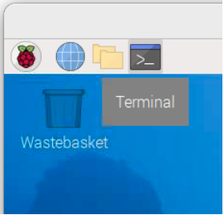

* Verifique se a câmera está sendo reconhecida corretamente:

```bash
libcamera-hello --list-cameras
```

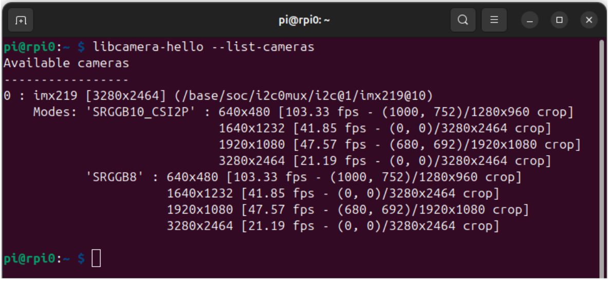

* Faça um teste para verificação do funcionamento da câmera

```bash
libcamera-hello
```

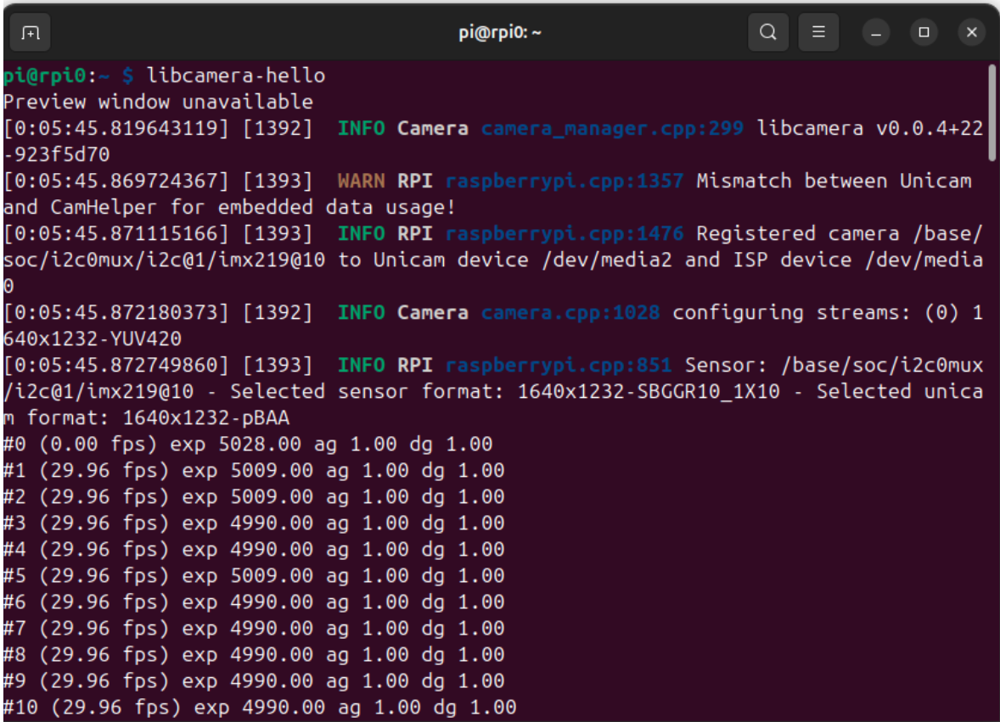

* Para maiores detalhes leia a documentação disponível em:  
  * [https://www.raspberrypi.com/documentation/accessories/camera.html](https://www.raspberrypi.com/documentation/accessories/camera.html)  
  * [https://www.raspberrypi.com/documentation/computers/camera\_software.html](https://www.raspberrypi.com/documentation/computers/camera_software.html)

## Referências

* Principais referências para configuração inicial:   
  * Instalação do sistema operacional:  
    * [https://www.raspberrypi.com/software/](https://www.raspberrypi.com/software/)  
  * Configuração geral do sistema através da ferramenta raspi-config:  
    * [https://www.raspberrypi.com/documentation/computers/configuration.html](https://www.raspberrypi.com/documentation/computers/configuration.html)  
  * Configuração de acesso remoto:  
    * [https://www.raspberrypi.com/documentation/computers/remote-access.htm](https://www.raspberrypi.com/documentation/computers/remote-access.html)
