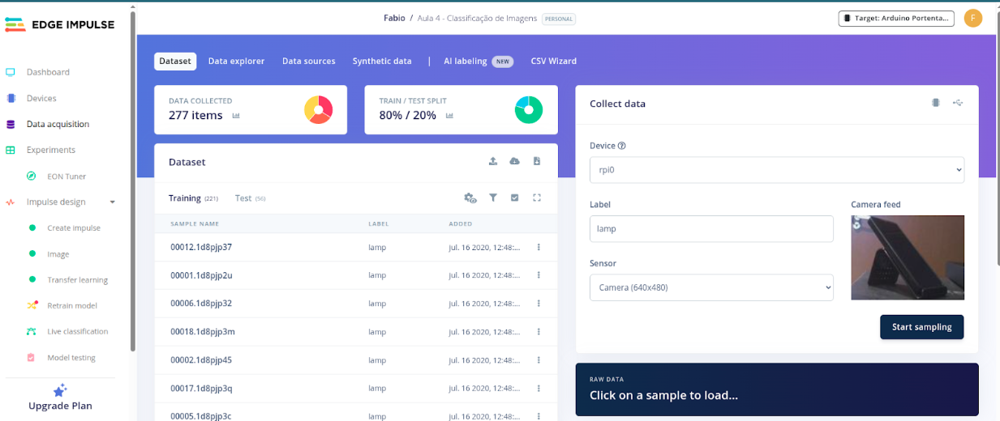

# **Instalação do Edge Impulse Linux CLI e SDK no Raspberry Pi**

Este tutorial guiará você pelo processo de instalação e configuração do **Edge Impulse Linux CLI** no Raspberry Pi conforme descrito pela documentação em [Edge Impulse CLI Installation](https://docs.edgeimpulse.com/tools/clis/edge-impulse-cli/installation#linux%2C-ubuntu%2C-macos%2C-and-raspbian-os) e no [Edge Impulse SDk Instalation->Raspberry Pi](https://docs.edgeimpulse.com/hardware/boards/raspberry-pi-4).

## **Passo 1: Configurações Iniciais do Raspberry Pi**

Antes de executar esse tutorial você deve ter realizado o tutorial  [Configurações iniciais do Raspberry Pi(RPi)](https://drive.google.com/file/d/1dKrleM3OK_qAawMq2JHHtL2fWWlyE3kw/view?usp=sharing). Antes de começarmos, certifique-se de que o Raspberry Pi está atualizado e com as configurações básicas prontas. Se necessário, revise as etapas iniciais de configuração do Raspberry Pi, como a habilitação da interface de câmera e a conexão com a rede. 

## **Passo 2: Atualização do Sistema**

Ligue o RPi e atualize o sistema para garantir que todas as bibliotecas e pacotes estejam atualizados. No terminal, execute o comando:

```bash
sudo apt update
```

## **Passo 3: Instalar Node.js**

Para instalar o Node.js v16.x+ ou superior execute os seguintes comandos:

```bash
curl -sL https://deb.nodesource.com/setup_22.x | sudo -E bash - |
```

Agora vamos instalar o [Node.js](http://Node.js) e algumas dependências:
```bash
sudo apt install -y gcc g++ make build-essential nodejs sox gstreamer1.0-tools gstreamer1.0-plugins-good gstreamer1.0-plugins-base gstreamer1.0-plugins-base-apps -y |
```

Certifique-se que o comando abaixo retorna uma versão v16 ou superior para o node. 
```bash
 node -v 
```

Certifique-se de que o diretório de instalação do node com o seguinte comando:
```bash
npm config get prefix
```

Se o comando anterior não retornar /home/pi/.npm-global, execute os seguintes comandos para definir o diretório padrão para o npm
```bash
mkdir ~/.npm-global
npm config set prefix '~/.npm-global'
echo 'export PATH=~/.npm-global/bin:$PATH' >> ~/.profile 
```

## **Passo 4: Instalar o Edge Impulse CLI (central de desenvolvimento)**

Agora que as dependências estão instaladas, instale o **Edge Impulse Linux CLI** utilizando o **npm** (gerenciador de pacotes do Node.js):
```bash
sudo npm install edge-impulse-cli -g --unsafe-perm 
```

Essa instalação pode demorar alguns minutos.

O edge-impulse-cli é uma suíte de ferramentas de propósito geral que serve como a principal ponte entre o seu ambiente de desenvolvimento local e os projetos na nuvem do Edge Impulse Studio. Suas principais funcionalidades incluem:

* **Coleta de Dados:** Através de ferramentas como o edge-impulse-data-forwarder, é possível conectar uma vasta gama de microcontroladores e sensores ao seu computador e enviar os dados diretamente para o seu projeto no Edge Impulse.  
* **Gerenciamento de Dispositivos:** Permite o controle de dispositivos locais conectados, atuando como um proxy para sincronizar dados de placas que não possuem conexão direta com a internet.  
* **Upload de Arquivos:** Facilita o envio de conjuntos de dados já existentes (como arquivos de áudio, imagens ou CSV) para a plataforma.  
* **Execução de Impulsos em Dispositivos Conectados:** Com o comando edge-impulse-run-impulse, é possível testar o seu modelo (impulso) em tempo real no dispositivo que está coletando os dados.  
* **Flash de Firmware:** Inclui utilitários para gravar o firmware em placas de desenvolvimento específicas.

Em resumo, o edge-impulse-cli é a sua ferramenta essencial durante a fase de coleta de dados, treinamento e iteração do seu modelo de Machine Learning.

## **Passo 5: Instalar o Edge Impulse para Linux(Executor de Inferência)**

Para isso, instale as ferramentas destinadas a testes em dispositivos de inferência: 
```bash
sudo npm install edge-impulse-linux -g --unsafe-perm 
```

Por outro lado, o edge-impulse-linux é uma ferramenta especializada, focada na etapa de implantação do seu modelo treinado em dispositivos que rodam um sistema operacional Linux, como Raspberry Pi, NVIDIA Jetson Nano ou qualquer computador com arquitetura x86_64, ARMv7 ou AARCH64. Suas características centrais são:

* **Download de Modelos Compilados:** A principal função, executada através do edge-impulse-linux-runner, é baixar o seu impulso treinado como um arquivo executável autocontido (.eim).  
* **Execução de Inferência Local:** Permite que você execute o modelo (.eim) diretamente no dispositivo Linux para realizar a inferência, ou seja, fazer previsões com base em novos dados.  
* **Otimização para a Arquitetura Alvo:** Os modelos `.eim` são compilados e otimizados especificamente para a arquitetura do processador do seu dispositivo Linux, garantindo o melhor desempenho possível.  
* **SDKs para Integração:** Fornece Kits de Desenvolvimento de Software (SDKs) para linguagens como Python, Node.js e Go, permitindo que você integre facilmente a execução do modelo em suas próprias aplicações.

Essencialmente, o edge-impulse-linux entra em cena quando o seu modelo está treinado e pronto para ser implantado em um dispositivo Linux para uso em um produto ou aplicação final.

## **Passo 6: Verificar o Acesso à Porta Serial**

Inicie a ingestão de dados transmitidos pela placa microcontroladora
```bash
edge-impulse-data-forwarder 
```

Você verá uma tela semelhante à que está abaixo, para iniciar o envio de dados para seu projeto no edge-impulse.

```bash
Edge Impulse data forwarder v1.34.1 Endpoints:     Websocket: wss://remote-mgmt.edgeimpulse.com     API:       https://studio.edgeimpulse.com     Ingestion: https://ingestion.edgeimpulse.com [SER] Connecting to /dev/ttyACM0 [SER] Serial is connected (85:53:13:03:63:03:51:80:51:40) [WS] Connecting to wss://remote-mgmt.edgeimpulse.com [WS] Connected to wss://remote-mgmt.edgeimpulse.com ? To which project do you want to connect this device? (🔍 type to search) (Pres s <enter> to submit)  ❯ Fabio / Cifar10_Image_Classification_60k   Fabio  Cifar10_Image_Classification_12_dog_cat   Fabio / rpi-cam   Fabio / Car Parking Occupancy Detection - FOMO (Move up and down to reveal more choices) |
```

## **Passo 7: Verificar o Acesso à Câmera**

Após a instalação, é importante verificar se a câmera do Raspberry Pi está funcionando corretamente com o Edge Impulse. Então execute o seguinte comando:
```bash
edge-impulse-linux
```

Este comando verifica se a câmera está acessível pra o Edge Impulse. Despois de ter selecionado o seu projeto do Edge Impulse,  você deve receber uma saída semelhante a esta:
```bash
Edge Impulse Linux client v1.17.5 [SER] Using microphone hw:0,0 [GST] checking for /etc/os-release [SER] Connected to camera /base/soc/i2c0mux/i2c@1/imx219@10 [WS] Connecting to wss://remote-mgmt.edgeimpulse.com [WS ] Connected to wss://remote-mgmt.edgeimpulse.com [WS] Device "rpi0" is now connected to project "Aula 4 - Classificação de Imagens". To connect to another project, run `edge-impulse-linux --clean`. [WS] Go to https://studio.edgeimpulse.com/studio/420760/acquisition/training to build your machine learning model! |
```

## **Passo 8: Confira o feed da câmera no seu projeto**

Depois de executar o comando, um streaming de vídeo da câmera será transmitido para o seu projeto na parte de Data Acquisition.



## **Conclusão**

A partir de agora, sua câmera está configurada e pronta para ser utilizada no **Edge Impulse Studio**, permitindo a captura de dados e desenvolvimento de modelos de machine learning diretamente no Raspberry Pi.

Caso encontre problemas com o acesso à câmera ou à interface web, verifique as configurações de rede do Raspberry Pi e a ativação correta da câmera nas configurações do sistema.
