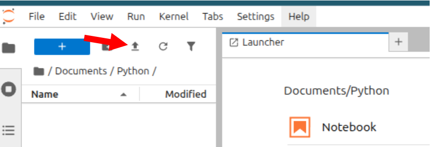

# Classificação de Imagens com TensorFlow Lite no Raspberry Pi
> Esse roteiro foi adaptado da seção [*Image Classification Fundamentals*](https://mjrovai.github.io/EdgeML_Made_Ease_ebook/raspi/image_classification/image_classification_fund.html) do [Prof. Marcelo Rovai](https://github.com/Mjrovai) no livro [*EdgeML Made Easy*](https://mjrovai.github.io/EdgeML_Made_Ease_ebook/) e do repositório do GitHub [Edge Machine Learning Systems Engineering](https://github.com/Mjrovai/UNIFEI-IESTI05-EDGE_AI/tree/main).

## Baixar os Notebooks para esse Roteiro
- Baixe os notebooks para esse roteiro clonando o repositório inteiro com `git` **em seu computador desktop**. O `git` é um sistema de controle de versão distribuído amplamente utilizado para rastrear mudanças em arquivos e coordenar o trabalho em projetos de desenvolvimento de software.
    1. Abra seu terminal no seu computador pessoal (`CTRL`+`ALT`+`T`). 
    2. Navegue até o diretório onde deseja clonar o repositório. Por exemplo, para ir para a pasta `Documentos`:
        ```bash
        cd ~/Documentos
        ```
    3. Use o comando `git clone` seguido do URL do repositório para clonar o repositório:
        ```bash
        git clone https://github.com/fabiobento/sis-emb-2025-2.git
        ```
    4. Após a conclusão do comando, um novo diretório chamado `sis-emb-2025-2` será criado no diretório atual, contendo todos os arquivos do repositório.
    
    5. Os notebooks para esse roteiro estarão disponíveis no seu computador no seguinte caminho: `sis-emb-2025-2/aulas/sbc-rpi/rpi_img_class_tflite/docs/`


## Criação de um primeiro Notebook jupyter no Raspberry Pi
- Inicie um servidor no Raspberry Pi conforme descrito na seção "Opção B: Iniciando o JupyterLab (Moderno e Completo)" do roteiro de laboratório [Instalação de Bibliotecas Python para o RPi](../rpi_ei_linux_sdk/rpi_ei_linux_sdk.md).
- Defina o diretório de trabalho no Raspberry Pi e crie um novo notebook Python 3:
    ```bash
    cd  ~/Documents
    mkdir Python
    cd Python
    ```
- Transfira o notebook chamado [`primeiro-notebook-jupyter.ipynb`](https://github.com/fabiobento/sis-emb-2025-2/blob/main/aulas/sbc-rpi/rpi_img_class_tflite/docs/1_primeiro-jupyter-notebook.ipynb) para seu RPi, na pasta `~/Documents/Python/` usando o botão `Upload Files` do `Jupyter`.

- Clique no ícone do `File Browser` (1) para abrir o navegador de arquivos, depois clique em `Upload` (2) e selecione o arquivo do notebook em seu computador (3). Após selecionar o arquivo, clique em `Open` (4) e depois em `Upload` (5) para completar o processo.
- Com o arquivo carregado, faça um duplo clique nele para abrir o notebook no JupyterLab.

- Agora você pode executar as células do notebook clicando nelas e pressionando `SHIFT` + `ENTER`.
## Classificação de imagens com TensorFlow Lite
- A seguir, vamos carregar um modelo pré-treinado do TensorFlow Lite e usá-lo para classificar as imagens capturadas. Para seguir esse roteiro, você precisará ter o TensorFlow Lite instalado no seu Raspberry Pi. Então, se você ainda não instalou o TensorFlow Lite, siga as instruções na seção "Instalando o TensorFlow Lite no Raspberry Pi" do roteiro de laboratório [Instalação de Bibliotecas Python para o RPi](../rpi_ei_linux_sdk/rpi_ei_linux_sdk.md). Se quiser  aprender detalhes mais específicos sobre o Tensorflow Lite consulte essa [Visão geral do LiteRT](https://www.tensorflow.org/lite) e o [Guia de início rápido para dispositivos baseados em Linux com Python](https://ai.google.dev/edge/litert/microcontrollers/python?hl=pt-br)

### Verificar as configurações do TFlite

- Crie um novo diretório de trabalho
    - Crie os novos diretório `TFLITE` `IMG_CLASS` e `models` no Raspberry Pi conforme a estrutura abaixo:
        ```bash
        Documents/
        |-- Python
        `-- TFLITE
            `-- IMG_CLASS
                `-- models
        ```
- Faça o upload do notebook [2_teste_setup.ipynb](https://github.com/fabiobento/sis-emb-2025-2/blob/main/aulas/sbc-rpi/rpi_img_class_tflite/docs/2_teste_setup.ipynb) para o RPi na pasta `~/Documents/TFLITE/IMG_CLASS/` usando o botão `Upload Files` do `Jupyter`, conforme mostrado anteriormente.
- Agora interaja com o notebook para verificar a configuração do Tflite.

### Fazendo Inferências com o  Mobilenet V2
- Na última seção, verificamos a configuração do ambiente, incluindo o download de um modelo pré-treinado popular, o `Mobilenet V2`, treinado em imagens 224x224 (1,2 milhão) do `ImageNet` para 1.001 classes (1.000 categorias de objetos mais 1 fundo). O modelo foi convertido para um formato `TensorFlow Lite` compacto de 3,5 MB, tornando-o adequado para o armazenamento e a memória limitados de um RPi.


<span style="font-size:80%">
Fonte: <a href="https://mjrovai.github.io/
EdgeML_Made_Ease_ebook/" target="_blank">*EdgeML Made Easy*</a>
</span>

- Vamos praticar a classificação de imagens usando esse modelo pré-treinado no RPi.
- O fluxo de trabalho geral (*inference pipeline*) para fazer inferências com o modelo `Mobilenet V2` no RPi é o seguinte:
    1. Carregar o modelo TFLite pré-treinado no RPi.
    2. Preparar uma imagem de entrada (redimensionar, normalizar, etc).
    3. Executar a inferência usando o modelo carregado.
    4. Interpretar os resultados da inferência (obter as classes previstas e suas probabilidades).


<span style="font-size:80%">
Fonte: <a href="https://mjrovai.github.io/
EdgeML_Made_Ease_ebook/" target="_blank">*EdgeML Made Easy*</a>
</span>


- Faça o upload do notebook [3_Image_Classification.ipynb](https://github.com/fabiobento/sis-emb-2025-2/blob/main/aulas/sbc-rpi/rpi_img_class_tflite/docs/3_Image_Classification.ipynb) para o RPi na pasta `~/Documents/TFLITE/IMG_CLASS/` usando o botão `Upload Files` do `Jupyter`, conforme mostrado anteriormente. Esse notebook está na pasta `sis-emb-2025-2/aulas/sbc-rpi/rpi_img_class_tflite/docs/3_Image_Classification.ipynb` do repositório clonado.

- Agora interaja com o notebook para fazer inferências com o modelo `Mobilenet V2`.

### Treinando um modelo do zero

Vamos treinar um modelo TFLite do zero para embarcá-lo no RPi.

O modelo vai ser treinado em servidores na nuvem no *Google Colab*, convertidos para o formato TFlite, e embarcados no RPi.

- Para iniciar o treinamento na nuvem:
    1. Faça o login em sua conta do Google no navegador Web do desktop (Google Chorme, Firefox, etc) 
    2. Clique no [nesse link para o notebook](https://colab.research.google.com/github/fabiobento/sis-emb-2025-2/blob/main/aulas/sbc-rpi/rpi_img_class_tflite/docs/4_CNN_Cifar_10_TFLite.ipynb)

### Embarcando no RPi o modelo treinado na nuvem
- Após treinar e converter o modelo no Colab, baixe os arquivos  `cifar10.tflite` e `cifar10_quant.tflite` para o seu computador desktop.
- Transfira o arquivo `cifar10.tflite` para o RPi, na pasta `~/Documents/TFLITE/IMG_CLASS/models/` usando o botão `Upload Files` do `Jupyter`, conforme mostrado anteriormente.
- Faça o upload do notebook [Cifar 10 - Classificação de Imagens no RPi com TFLite](https://github.com/fabiobento/sis-emb-2025-2/blob/main/aulas/sbc-rpi/rpi_img_class_tflite/docs/5_Cifar_Image_Classification.ipynb) para o RPi na pasta `~/Documents/TFLITE/IMG_CLASS/` usando o botão `Upload Files` do `Jupyter`, conforme mostrado anteriormente. Esse notebook no arquivo `sis-emb-2025-2/aulas/sbc-rpi/rpi_img_class_tflite/docs/5_Cifar_Image_Classification.ipynb` do repositório clonado.
- Agora interaja com o notebook para fazer inferências com o modelo treinado no Colab e embarcado no RPi.

## Projeto de Classificação de Imagens com Servidor Flask no RPi

Vamos criar um projeto completo de classificação de imagens usando o Edge Impulse Studio. Como fizemos com o Mobilinet V2, o modelo treinado e convertido para o formato TFLiteserá utilizado para inferencias no RPi.

Esse é o fluxo de trabalho que você usará em seu projeto:


<span style="font-size:80%">
Fonte: <a href="https://mjrovai.github.io/
EdgeML_Made_Ease_ebook/" target="_blank">*EdgeML Made Easy*</a>
</span>

### O Objetivo do Projeto
O primeiro passo em qualquer projeto de ML é definir seu objetivo. Neste caso, é detectar e classificar dois objetos específicos presentes em uma imagem. Para esse projeto, usarei como exemplo dois pequenos brinquedos: um personagem (`grogu`) e uma espaçonave de ficção científica (`falcon`). Também coletei imagens de um fundo(`background`) com esses dois objetos estão ausentes.


### Coleta de Dados
Depois de definirmos objetivo de nosso projeto de aprendizado de máquina, a próxima etapa, e a mais importante, é coletar o conjunto de dados.

Podemos usar um telefone para capturar as imagens, mas aqui usaremos o RPi.

Vamos configurar um servidor web simples no nosso RPi para visualizar as imagens capturadas em QVGA em um navegador.

1. Primeiro, vamos instalar a biblioteca `Flask` no RPi:
    ```bash
    pip3 install flask
    ```
2. Vá para a pasta de trabalho (`IMG_CLASS`) e crie um novo script Python combinando a captura de imagens com um servidor web. Vamos chamá-lo de [`get_img_data.py`](https://github.com/fabiobento/sis-emb-2025-2/blob/main/aulas/sbc-rpi/rpi_img_class_tflite/scripts/get_img_data.py):
```python
from flask import Flask, Response, render_template_string, request, redirect, url_for
from picamera2 import Picamera2
import io
import threading
import time
import os
import signal

app = Flask(__name__)

# Global variables
base_dir = "dataset"
picam2 = None
frame = None
frame_lock = threading.Lock()
capture_counts = {}
current_label = None
shutdown_event = threading.Event()

def initialize_camera():
    global picam2
    picam2 = Picamera2()
    config = picam2.create_preview_configuration(main={"size": (320, 240)})
    picam2.configure(config)
    picam2.start()
    time.sleep(2)  # Espere a câmera estabilizar

def get_frame():
    global frame
    while not shutdown_event.is_set():
        stream = io.BytesIO()
        picam2.capture_file(stream, format='jpeg')
        with frame_lock:
            frame = stream.getvalue()
        time.sleep(0.1)  # 

def generate_frames():
    while not shutdown_event.is_set():
        with frame_lock:
            if frame is not None:
                yield (b'--frame\r\n'
                       b'Content-Type: image/jpeg\r\n\r\n' + frame + b'\r\n')
        time.sleep(0.1)  # Ajuste conforme necessário para uma visualização suave

def shutdown_server():
    shutdown_event.set()
    if picam2:
        picam2.stop()
    # Dar algum tempo para que outros threads sejam concluídos.
    time.sleep(2)
    # Enviar SIGINT para o processo principal para encerrar o Flask
    os.kill(os.getpid(), signal.SIGINT)

@app.route('/', methods=['GET', 'POST'])
def index():
    global current_label
    if request.method == 'POST':
        current_label = request.form['label']
        if current_label not in capture_counts:
            capture_counts[current_label] = 0
        os.makedirs(os.path.join(base_dir, current_label), exist_ok=True)
        return redirect(url_for('capture_page'))
    return render_template_string('''
        <!DOCTYPE html>
        <html>
        <head>
            <title>Captura de conjunto de dados - Entrada de rótulo</title>
        </head>
        <body>
            <h1>Entre o rótulo para o conjunto de dados</h1>
            <form method="post">
                <input type="text" name="label" required>
                <input type="submit" value="Iniciar a captura">
            </form>
        </body>
        </html>
    ''')

@app.route('/capture')
def capture_page():
    return render_template_string('''
        <!DOCTYPE html>
        <html>
        <head>
            <title>Captura de conjunto de dados - </title>
            <script>
                var shutdownInitiated = false;
                function checkShutdown() {
                    if (!shutdownInitiated) {
                        fetch('/check_shutdown')
                            .then(response => response.json())
                            .then(data => {
                                if (data.shutdown) {
                                    shutdownInitiated = true;
                                    document.getElementById('video-feed').src = '';
                                    document.getElementById('shutdown-message').style.display = 'block';
                                }
                            });
                    }
                }
                setInterval(checkShutdown, 1000);  // Check every second
            </script>
        </head>
        <body>
            <h1>Captura do Conjunto de Dados</h1>
            <p>Rótulo Atual: {{ label }}</p>
            <p>Imagens capturadas para esse rótulo: {{ capture_count }}</p>
            
            <div id="shutdown-message" style="display: none; color: red;">
                Capture process has been stopped. You can close this window.
            </div>
            <form action="/capture_image" method="post">
                <input type="submit" value="Capturar Imagem">
            </form>
            <form action="/stop" method="post">
                <input type="submit" value="Parar a Captura" style="background-color: #ff6666;">
            </form>
            <form action="/" method="get">
                <input type="submit" value="Mudar o Rótulo" style="background-color: #ffff66;">
            </form>
        </body>
        </html>
    ''', label=current_label, capture_count=capture_counts.get(current_label, 0))

@app.route('/video_feed')
def video_feed():
    return Response(generate_frames(),
                    mimetype='multipart/x-mixed-replace; boundary=frame')

@app.route('/capture_image', methods=['POST'])
def capture_image():
    global capture_counts
    if current_label and not shutdown_event.is_set():
        capture_counts[current_label] += 1
        timestamp = time.strftime("%Y%m%d-%H%M%S")
        filename = f"image_{timestamp}.jpg"
        full_path = os.path.join(base_dir, current_label, filename)
        
        picam2.capture_file(full_path)
    
    return redirect(url_for('capture_page'))

@app.route('/stop', methods=['POST'])
def stop():
    summary = render_template_string('''
        <!DOCTYPE html>
        <html>
        <head>
            <title>Captura de conjunto de dados - Parado</title>
        </head>
        <body>
            <h1>Captura de conjunto de dados interrompida</h1>
            <p>O processo de captura foi interrompido. Você pode fechar essa janela.</p>
            <p>Resumo de capturas:</p>
            <ul>
            
                <li>{{ label }}: {{ count }} images</li>
            
            </ul>
        </body>
        </html>
    ''', capture_counts=capture_counts)
    
    # Start a new thread to shutdown the server
    threading.Thread(target=shutdown_server).start()
    
    return summary

@app.route('/check_shutdown')
def check_shutdown():
    return {'shutdown': shutdown_event.is_set()}

if __name__ == '__main__':
    initialize_camera()
    threading.Thread(target=get_frame, daemon=True).start()
    app.run(host='0.0.0.0', port=5000, threaded=True)
```
3. Execute o script:
    ```bash
    python3 get_img_data.py
    ```
4. Acesse a interface web:

    Abra um navegador web em seu computador desktop e acesse o endereço do RPi na porta 5000. Por exemplo:
    ```bash
    http://rpi0.local:5000
    ```

O script [`get_img_data.py`](https://github.com/fabiobento/sis-emb-2025-2/blob/main/aulas/sbc-rpi/rpi_img_class_tflite/scripts/get_img_data.py) cria uma interface baseada na web para capturar e organizar conjuntos de dados de imagens usando um RPi e sua câmera.
- Principais recursos do script:
    - **Interface web**: acessível a partir de qualquer dispositivo na mesma rede que o RPi.
    - **Visualização ao vivo da câmera**: mostra uma transmissão em tempo real da câmera.
    - **Sistema de rotulagem**: permite que os usuários insiram rótulos para diferentes categorias de imagens.
    - **Armazenamento organizado**: salva automaticamente as imagens em subdiretórios específicos para cada rótulo.
    - **Contadores por rótulo**: mantém o controle de quantas imagens são capturadas para cada rótulo.
    - **Estatísticas resumidas**: fornece um resumo das imagens capturadas ao interromper o processo de captura.

- Componentes principais:
    - **Aplicativo Web Flask**: Gerencia o roteamento e serve a interface web.
    - **Integração Picamera2**: Controla a câmera Raspberry Pi.
    - **Captura de quadros em thread**: Garante uma pré-visualização ao vivo suave.
    - **Gerenciamento de arquivos**: Organiza as imagens capturadas em diretórios rotulados.    

- Funções principais:
    - `initialize_camera()`: Configura a instância `Picamera2`.
    - `get_frame()`: Captura quadros continuamente para a visualização ao vivo.
    - `generate_frames()`: Produz quadros para a transmissão de vídeo ao vivo.
    - `shutdown_server()`: Define o evento de desligamento, interrompe a câmera e desliga o servidor `Flask`.
    - `index()`: Gerencia a página de entrada de rótulos.
    - `capture_page()`: Exibe a interface principal de captura.
    - `video_feed()`: Mostra uma pré-visualização ao vivo para posicionar a câmera.
    - `capture_image()`: Salva uma imagem com a etiqueta atual.
    - `stop()`: Interrompe o processo de captura e exibe um resumo.

- Fluxo de uso:
    1. Inicie o script no seu RPi.
    2. Acesse a interface web a partir de um navegador.
    3. Digite uma etiqueta para as imagens que deseja capturar e pressione `Iniciar Captura`.

    
    4. Use a imagem ao vivo para posicionar a câmera
    5. Clique em `Capturar Imagem` para salvar uma imagem com o rótulo atual.
    
    6. Mude os rótulos conforme necessário clicando em `Mudar o Rótulo`.
    7. Quando terminar, clique em `Parar a Captura` para encerrar e visualizar um resumo das imagens capturadas.

- Notas técnicas:
    - O script usa *threading* para lidar com a captura simultânea de quadros e o serviço web.
    - As imagens são salvas com *timestamps* de data/hora em seus nomes de arquivo para garantir a exclusividade.
    - A interface web é responsiva e pode ser acessada a partir de dispositivos móveis.
-Possibilidades de personalização:
    - Ajuste a resolução da imagem na função `initialize_camera()`. Aqui, usamos QVGA ($320 \times 240$).
    - Modifique os modelos HTML para obter uma aparência diferente.
    - Adicione etapas adicionais de processamento ou análise de imagem na função `capture_image()`.

- Número de amostras no conjunto de dados:
    - **Obtenha cerca de 60 imagens de cada categoria**. Tente capturar diferentes ângulos, fundos e condições de luz.
    - No RPi, terminaremos com uma pasta chamada dataset, que contém três subpastas, uma para cada classe de imagens.
