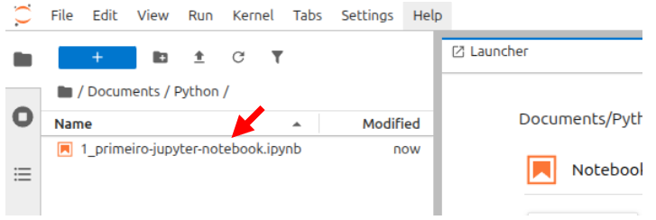
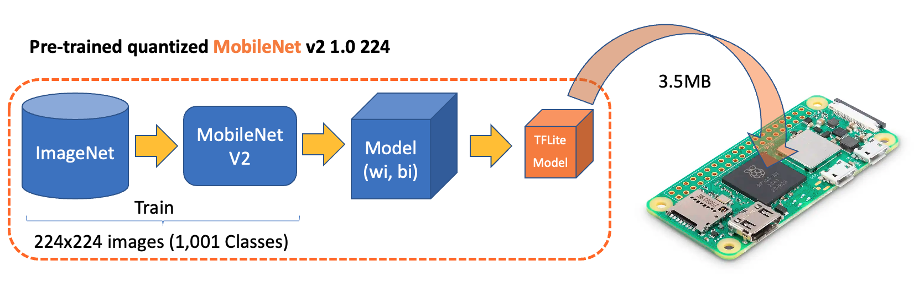
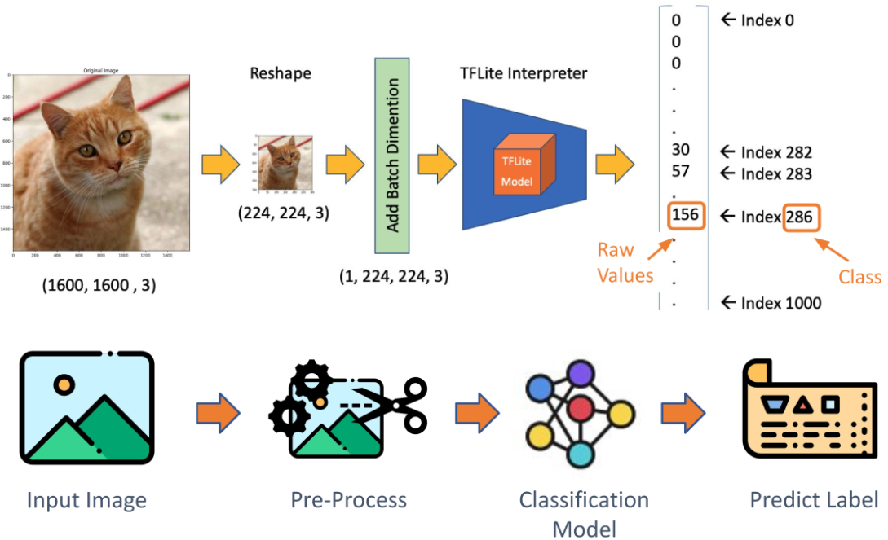

# Classificação de Imagens com TensorFlow Lite no Raspberry Pi
> Esse roteiro foi adaptado da seção [*Image Classification Fundamentals*](https://mjrovai.github.io/EdgeML_Made_Ease_ebook/raspi/image_classification/image_classification_fund.html) do [Prof. Marcelo Rovai](https://github.com/Mjrovai) no livro [*EdgeML Made Easy*](https://mjrovai.github.io/EdgeML_Made_Ease_ebook/) e do repositório do GitHub [Edge Machine Learning Systems Engineering](https://github.com/Mjrovai/UNIFEI-IESTI05-EDGE_AI/tree/main).

## 1. Baixar os Notebooks para esse Roteiro
- Baixe os notebooks para esse roteiro clonando o repositório inteiro com `git` **em seu computador desktop**. O `git` é um sistema de controle de versão distribuído amplamente utilizado para rastrear mudanças em arquivos e coordenar o trabalho em projetos de desenvolvimento de software.
    1. Abra seu terminal no seu computador pessoal (`CTRL`+`ALT`+`T`). 
    2. Navegue até o diretório onde deseja clonar o repositório. Por exemplo, para ir para a pasta `Documentos`:
        ```bash
        cd ~/Documentos
        ```
    3. Use o comando `git clone` seguido do URL do repositório para clonar o repositório:
        ```bash
        git clone https://github.com/fabiobento/sis-emb-2025-2.git
        ```
    4. Após a conclusão do comando, um novo diretório chamado `sis-emb-2025-2` será criado no diretório atual, contendo todos os arquivos do repositório.
    
    5. Os notebooks para esse roteiro estarão disponíveis no seu computador no seguinte caminho: `sis-emb-2025-2/aulas/sbc-rpi/rpi_img_class_tflite/docs/`


## 2. Criação de um primeiro Notebook jupyter no Raspberry Pi
- Inicie um servidor no Raspberry Pi conforme descrito na seção "Opção B: Iniciando o JupyterLab (Moderno e Completo)" do roteiro de laboratório [Instalação de Bibliotecas Python para o RPi](../rpi_ei_linux_sdk/rpi_ei_linux_sdk.md).
- Defina o diretório de trabalho no Raspberry Pi e crie um novo notebook Python 3:
    ```bash
    cd  ~/Documents
    mkdir Python
    cd Python
    ```
- Transfira o notebook chamado [`primeiro-notebook-jupyter.ipynb`](https://github.com/fabiobento/sis-emb-2025-2/blob/main/aulas/sbc-rpi/rpi_img_class_tflite/docs/1_primeiro-jupyter-notebook.ipynb) para seu RPi, na pasta `~/Documents/Python/` usando o botão `Upload Files` do `Jupyter`.


- Clique no ícone do `File Browser` (1) para abrir o navegador de arquivos, depois clique em `Upload` (2) e selecione o arquivo do notebook em seu computador (3). Após selecionar o arquivo, clique em `Open` (4) e depois em `Upload` (5) para completar o processo.
- Com o arquivo carregado, faça um duplo clique nele para abrir o notebook no JupyterLab.

- Agora você pode executar as células do notebook clicando nelas e pressionando `SHIFT` + `ENTER`.
## 3. Classificação de imagens com TensorFlow Lite
- A seguir, vamos carregar um modelo pré-treinado do TensorFlow Lite e usá-lo para classificar as imagens capturadas. Para seguir esse roteiro, você precisará ter o TensorFlow Lite instalado no seu Raspberry Pi. Então, se você ainda não instalou o TensorFlow Lite, siga as instruções na seção "Instalando o TensorFlow Lite no Raspberry Pi" do roteiro de laboratório [Instalação de Bibliotecas Python para o RPi](../rpi_ei_linux_sdk/rpi_ei_linux_sdk.md). Se quiser  aprender detalhes mais específicos sobre o Tensorflow Lite consulte essa [Visão geral do LiteRT](https://www.tensorflow.org/lite) e o [Guia de início rápido para dispositivos baseados em Linux com Python](https://ai.google.dev/edge/litert/microcontrollers/python?hl=pt-br)

### 3.1 Verificar as configurações do TFlite

- Crie um novo diretório de trabalho
    - Crie os novos diretório `TFLITE` `IMG_CLASS` e `models` no Raspberry Pi conforme a estrutura abaixo:
        ```bash
        Documents/
        |-- Python
        `-- TFLITE
            `-- IMG_CLASS
                `-- models
        ```
- Faça o upload do notebook [2_teste_setup.ipynb](https://github.com/fabiobento/sis-emb-2025-2/blob/main/aulas/sbc-rpi/rpi_img_class_tflite/docs/2_teste_setup.ipynb) para o RPi na pasta `~/Documents/TFLITE/IMG_CLASS/` usando o botão `Upload Files` do `Jupyter`, conforme mostrado anteriormente.
- Agora interaja com o notebook para verificar a configuração do Tflite.

### 3.2 Fazendo Inferências com o  Mobilenet V2
- Na última seção, verificamos a configuração do ambiente, incluindo o download de um modelo pré-treinado popular, o `Mobilenet V2`, treinado em imagens 224x224 (1,2 milhão) do `ImageNet` para 1.001 classes (1.000 categorias de objetos mais 1 fundo). O modelo foi convertido para um formato `TensorFlow Lite` compacto de 3,5 MB, tornando-o adequado para o armazenamento e a memória limitados de um RPi.


<span style="font-size:80%">
Fonte: <a href="https://mjrovai.github.io/
EdgeML_Made_Ease_ebook/" target="_blank">*EdgeML Made Easy*</a>
</span>

- Vamos praticar a classificação de imagens usando esse modelo pré-treinado no RPi.
- O fluxo de trabalho geral (*inference pipeline*) para fazer inferências com o modelo `Mobilenet V2` no RPi é o seguinte:
    1. Carregar o modelo TFLite pré-treinado no RPi.
    2. Preparar uma imagem de entrada (redimensionar, normalizar, etc).
    3. Executar a inferência usando o modelo carregado.
    4. Interpretar os resultados da inferência (obter as classes previstas e suas probabilidades).


<span style="font-size:80%">
Fonte: <a href="https://mjrovai.github.io/
EdgeML_Made_Ease_ebook/" target="_blank">*EdgeML Made Easy*</a>
</span>


- Faça o upload do notebook [3_Image_Classification.ipynb](https://github.com/fabiobento/sis-emb-2025-2/blob/main/aulas/sbc-rpi/rpi_img_class_tflite/docs/3_Image_Classification.ipynb) para o RPi na pasta `~/Documents/TFLITE/IMG_CLASS/` usando o botão `Upload Files` do `Jupyter`, conforme mostrado anteriormente. Esse notebook está na pasta `sis-emb-2025-2/aulas/sbc-rpi/rpi_img_class_tflite/docs/3_Image_Classification.ipynb` do repositório clonado.

- Agora interaja com o notebook para fazer inferências com o modelo `Mobilenet V2`.

### 3.3 Treinando um modelo do zero

Vamos treinar um modelo TFLite do zero para embarcá-lo no RPi.

O modelo vai ser treinado em servidores na nuvem no *Google Colab*, convertidos para o formato TFlite, e embarcados no RPi.

- Para iniciar o treinamento na nuvem:
    1. Faça o login em sua conta do Google no navegador Web do desktop (Google Chorme, Firefox, etc) 
    2. Clique no [nesse link para o notebook](https://colab.research.google.com/github/fabiobento/sis-emb-2025-2/blob/main/aulas/sbc-rpi/rpi_img_class_tflite/docs/4_CNN_Cifar_10_TFLite.ipynb)

### 3.4 Embarcando no RPi o modelo treinado na nuvem
- Após treinar e converter o modelo no Colab, baixe os arquivos  `cifar10.tflite` e `cifar10_quant.tflite` para o seu computador desktop.
- Transfira o arquivo `cifar10.tflite` para o RPi, na pasta `~/Documents/TFLITE/IMG_CLASS/models/` usando o botão `Upload Files` do `Jupyter`, conforme mostrado anteriormente.
- Faça o upload do notebook [Cifar 10 - Classificação de Imagens no RPi com TFLite](https://github.com/fabiobento/sis-emb-2025-2/blob/main/aulas/sbc-rpi/rpi_img_class_tflite/docs/5_Cifar_Image_Classification.ipynb) para o RPi na pasta `~/Documents/TFLITE/IMG_CLASS/` usando o botão `Upload Files` do `Jupyter`, conforme mostrado anteriormente. Esse notebook no arquivo `sis-emb-2025-2/aulas/sbc-rpi/rpi_img_class_tflite/docs/5_Cifar_Image_Classification.ipynb` do repositório clonado.
- Agora interaja com o notebook para fazer inferências com o modelo treinado no Colab e embarcado no RPi.