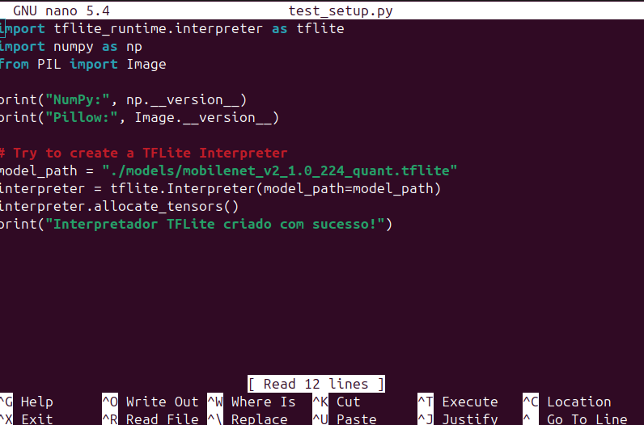
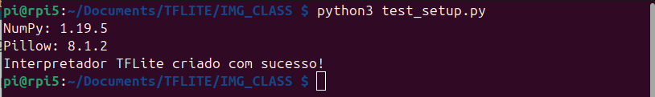
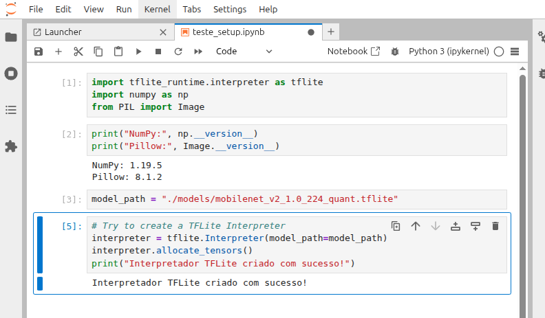
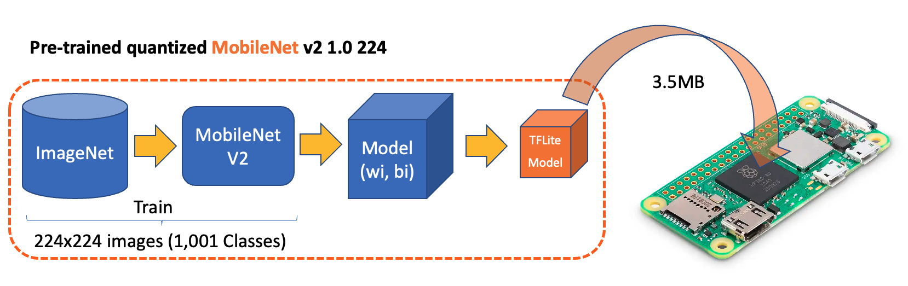

# Classificação de Imagens com TensorFlow Lite no Raspberry Pi
> Esse roteiro foi adaptado da seção [*Image Classification Fundamentals*](https://mjrovai.github.io/EdgeML_Made_Ease_ebook/raspi/image_classification/image_classification_fund.html) do [Prof. Marcelo Rovai](https://github.com/Mjrovai) no livro [*EdgeML Made Easy*](https://mjrovai.github.io/EdgeML_Made_Ease_ebook/) e do repositório do GitHub [Edge Machine Learning Systems Engineering](https://github.com/Mjrovai/UNIFEI-IESTI05-EDGE_AI/tree/main).


## Criação de um primeiro Notebook jupyter no Raspberry Pi
- Inicie um servidor no Raspberry Pi conforme descrito na seção "JupyterLab e Jupyter Notebook" do roteiro de laboratório [Instalação de Bibliotecas Python para o RPi](../rpi_ei_linux_sdk/rpi_ei_linux_sdk.md).
- Defina o diretório de trabalho no Raspberry Pi e crie um novo notebook Python 3:
    ```bash
    cd  ~/Documents
    mkdir Python
    cd Python
    ```
- Baixe o notebook chamado `primeiro-notebook-jupyter.ipynb` e pratique a criação e execução de células no Jupyter Notebook.
    ```bash
    !wget https://raw.githubusercontent.com/fabiobento/sis-emb-2025-2/main/aulas/sbc-rpi/rpi_img_class_tflite/docs/1_primeiro-jupyter-notebook.ipynb
    ```

---
## Classificação de imagens com TensorFlow Lite
- A seguir, vamos carregar um modelo pré-treinado do TensorFlow Lite e usá-lo para classificar as imagens capturadas. Para maiores detalhes sobre o Tensorflow Lite consulte essa [Visão geral do LiteRT](https://www.tensorflow.org/lite) e o [Guia de início rápido para dispositivos baseados em Linux com Python](https://ai.google.dev/edge/litert/microcontrollers/python?hl=pt-br)

### Configurar o TFlite

#### Crie um novo diretório pra trabalho
- Crie um novo diretório de trabalho no Raspberry Pi:
    ```bash
    mkdir Documents
    cd Documents/
    mkdir TFLITE
    cd TFLITE/
    mkdir IMG_CLASS
    cd IMG_CLASS
    mkdir models
    cd models
    ```
#### Baixe o modelo pré-treinado MobileNetV2    

- Um modelo pré-treinado adequado é muito importante para o sucesso da classificação de imagens em dispositivos com recursos limitados, como o Raspberry Pi.
- O [*MobileNet*](https://github.com/tensorflow/models/tree/master/research/slim/nets/mobilenet) foi projetado para aplicações móveis e de visão embarcada, com um bom equilíbrio entre precisão e velocidade
- Várias versões estão disponíveis: `MobileNetV1`, `MobileNetV2`, `MobileNetV3`. Vamos baixar a V2:
    ```bash
    wget https://storage.googleapis.com/download.tensorflow.org/models/tflite_11_05_08/mobilenet_v2_1.0_224_quant.tgz

    tar xzf mobilenet_v2_1.0_224_quant.tgz
    ```
- Agora vamos baixar também os rótulos (labels) das classes:
    ```bash
    wget https://raw.githubusercontent.com/Mjrovai/EdgeML-with-Raspberry-Pi/refs/heads/main/IMG_CLASS/models/labels.txt
    ```
- Se você listar os arquivos do diretório `models`, verá:
    ```bash
    ls -l
    ```
    ```bash
    total 105208
    drwxr-xr-x 3 pi pi     4096 Oct 14 11:29 .
    drwxr-xr-x 4 pi pi     4096 Oct 14 11:31 ..
    drwxr-xr-x 2 pi pi     4096 Oct 14 11:29 .ipynb_checkpoints
    -rw-r--r-- 1 pi pi    10484 Oct 14 11:29 labels.txt
    -rw-r----- 1 pi pi 28325008 Oct  2  2018 mobilenet_v2_1.0_224_quant.ckpt.data-00000-of-00001
    -rw-r----- 1 pi pi    55835 Aug 29  2018 mobilenet_v2_1.0_224_quant.ckpt.index
    -rw-r----- 1 pi pi 16224984 Aug 29  2018 mobilenet_v2_1.0_224_quant.ckpt.meta
    -rw-r----- 1 pi pi  3577760 Aug 29  2018 mobilenet_v2_1.0_224_quant.tflite
    -rw-r--r-- 1 pi pi 43420937 Oct  3  2018 mobilenet_v2_1.0_224_quant.tgz
    -rw-r----- 1 pi pi  1622974 Aug 29  2018 mobilenet_v2_1.0_224_quant_eval.pbtxt
    -rw-r----- 1 pi pi 14459476 Aug 29  2018 mobilenet_v2_1.0_224_quant_frozen.pb
    -rw-r----- 1 pi pi       84 Aug 29  2018 mobilenet_v2_1.0_224_quant_info.txt
    ``` 
- No entanto, apenas precisamos do modelo `mobilenet_v2_1.0_224_quant.tflite` e do arquivo `labels.txt` com os rótulos das classes. Você pode apagar os outros arquivos baixados.
    - O arquivo `labels.txt` contém os rótulos das 1001 classes do modelo MobileNetV2, que são usados para interpretar as previsões do modelo.

#### Verificando o setup
- Vamos testar o nosso setup rodando um simples script Python que carrega o modelo e os rótulos, e imprime algumas informações.
- Vá para o diretório `/home/pi/Documents/TFLITE/IMG_CLASS/`:
    ```bash
    cd ~/Documents/TFLITE/IMG_CLASS/
    ```
- Crie um arquivo Python chamado `test_setup.py` com o seguinte conteúdo:
    ```python
    import tflite_runtime.interpreter as tflite
    import numpy as np
    from PIL import Image

    print("NumPy:", np.__version__)
    print("Pillow:", Image.__version__)

    # Try to create a TFLite Interpreter
    model_path = "./models/mobilenet_v2_1.0_224_quant.tflite"
    interpreter = tflite.Interpreter(model_path=model_path)
    interpreter.allocate_tensors()
    print("Interpretador TFLite criado com sucesso!")
    ```
- Podemos criar o script Python usando o editor `nano`, e salvando-o com `CTRL+O` + `ENTER`, e saindo com `CTRL+X`:
    ```bash
    nano test_setup.py
    ``` 
    

- E rodar o script:
    ```bash
    python3 test_setup.py
    ```
    

- Ou você pode executar o código acima em um novo [notebook Jupyter](https://github.com/fabiobento/sis-emb-2025-2/blob/main/aulas/sbc-rpi/rpi_img_class_tflite/docs/2_teste_setup.ipynb):
    

### Fazendo Inferências com o  Mobilenet V2
- Na última seção, configuramos o ambiente, incluindo o download de um modelo pré-treinado popular, o `Mobilenet V2`, treinado em imagens 224x224 (1,2 milhão) do `ImageNet` para 1.001 classes (1.000 categorias de objetos mais 1 fundo). O modelo foi convertido para um formato `TensorFlow Lite` compacto de 3,5 MB, tornando-o adequado para o armazenamento e a memória limitados de um RPi.


<span style="font-size:80%">
Fonte: <a href="https://mjrovai.github.io/
EdgeML_Made_Ease_ebook/" target="_blank">*EdgeML Made Easy*</a>
</span>

```bash
# Instalar o Flask
pip3 install --upgrade flask
```