# Projeto de Classificação de Imagens com Servidor Flask no RPi

Vamos criar um projeto completo de classificação de imagens usando o Edge Impulse Studio. Como fizemos com o Mobilinet V2, o modelo treinado e convertido para o formato TFLiteserá utilizado para inferencias no RPi.

Esse é o fluxo de trabalho que você usará em seu projeto:

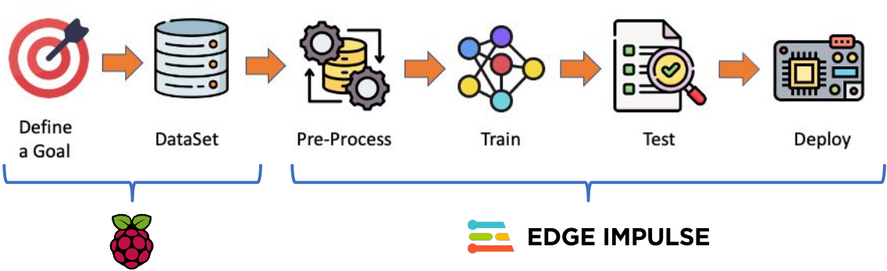
<span style="font-size:80%">
Fonte: <a href="https://mjrovai.github.io/
EdgeML_Made_Ease_ebook/" target="_blank">*EdgeML Made Easy*</a>
</span>

## 1. O Objetivo do Projeto
O primeiro passo em qualquer projeto de ML é definir seu objetivo. Neste caso, é detectar e classificar dois objetos específicos presentes em uma imagem. Para esse projeto, usarei como exemplo dois pequenos brinquedos: um personagem (`grogu`) e uma espaçonave de ficção científica (`falcon`). Também coletei imagens de um fundo(`background`) com esses dois objetos estão ausentes.

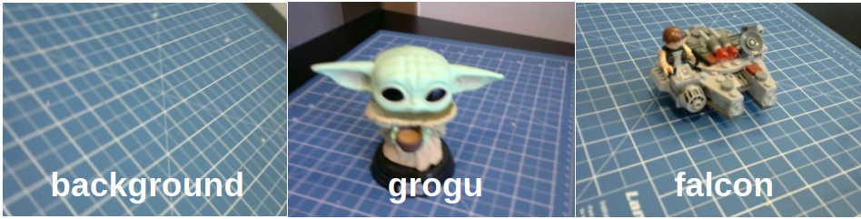

## 2. Coleta de Dados
Depois de definirmos objetivo de nosso projeto de aprendizado de máquina, a próxima etapa, e a mais importante, é coletar o conjunto de dados.

Podemos usar um telefone para capturar as imagens, mas aqui usaremos o RPi.

Vamos configurar um servidor web simples no nosso RPi para visualizar as imagens capturadas em QVGA em um navegador.

1. Primeiro, vamos instalar a biblioteca `Flask` no RPi:
    ```bash
    pip3 install flask
    pip3 install --user --upgrade flask
    ```
2. Vá para a pasta de trabalho (`IMG_CLASS`) e crie um novo script Python combinando a captura de imagens com um servidor web. Vamos chamá-lo de [`get_img_data.py`](https://github.com/fabiobento/sis-emb-2025-2/blob/main/aulas/sbc-rpi/rpi_img_class_tflite/scripts/get_img_data.py):
```python
from flask import Flask, Response, render_template_string, request, redirect, url_for
from picamera2 import Picamera2
import io
import threading
import time
import os
import signal

app = Flask(__name__)

# Global variables
base_dir = "dataset"
picam2 = None
frame = None
frame_lock = threading.Lock()
capture_counts = {}
current_label = None
shutdown_event = threading.Event()

def initialize_camera():
    global picam2
    picam2 = Picamera2()
    config = picam2.create_preview_configuration(main={"size": (320, 240)})
    picam2.configure(config)
    picam2.start()
    time.sleep(2)  # Espere a câmera estabilizar

def get_frame():
    global frame
    while not shutdown_event.is_set():
        stream = io.BytesIO()
        picam2.capture_file(stream, format='jpeg')
        with frame_lock:
            frame = stream.getvalue()
        time.sleep(0.1)  # 

def generate_frames():
    while not shutdown_event.is_set():
        with frame_lock:
            if frame is not None:
                yield (b'--frame\r\n'
                       b'Content-Type: image/jpeg\r\n\r\n' + frame + b'\r\n')
        time.sleep(0.1)  # Ajuste conforme necessário para uma visualização suave

def shutdown_server():
    shutdown_event.set()
    if picam2:
        picam2.stop()
    # Dar algum tempo para que outros threads sejam concluídos.
    time.sleep(2)
    # Enviar SIGINT para o processo principal para encerrar o Flask
    os.kill(os.getpid(), signal.SIGINT)

@app.route('/', methods=['GET', 'POST'])
def index():
    global current_label
    if request.method == 'POST':
        current_label = request.form['label']
        if current_label not in capture_counts:
            capture_counts[current_label] = 0
        os.makedirs(os.path.join(base_dir, current_label), exist_ok=True)
        return redirect(url_for('capture_page'))
    return render_template_string('''
        <!DOCTYPE html>
        <html>
        <head>
            <title>Captura de conjunto de dados - Entrada de rótulo</title>
        </head>
        <body>
            <h1>Entre o rótulo para o conjunto de dados</h1>
            <form method="post">
                <input type="text" name="label" required>
                <input type="submit" value="Iniciar a captura">
            </form>
        </body>
        </html>
    ''')

@app.route('/capture')
def capture_page():
    return render_template_string('''
        <!DOCTYPE html>
        <html>
        <head>
            <title>Captura de conjunto de dados - </title>
            <script>
                var shutdownInitiated = false;
                function checkShutdown() {
                    if (!shutdownInitiated) {
                        fetch('/check_shutdown')
                            .then(response => response.json())
                            .then(data => {
                                if (data.shutdown) {
                                    shutdownInitiated = true;
                                    document.getElementById('video-feed').src = '';
                                    document.getElementById('shutdown-message').style.display = 'block';
                                }
                            });
                    }
                }
                setInterval(checkShutdown, 1000);  // Check every second
            </script>
        </head>
        <body>
            <h1>Captura do Conjunto de Dados</h1>
            <p>Rótulo Atual: {{ label }}</p>
            <p>Imagens capturadas para esse rótulo: {{ capture_count }}</p>
            
            <div id="shutdown-message" style="display: none; color: red;">
                Capture process has been stopped. You can close this window.
            </div>
            <form action="/capture_image" method="post">
                <input type="submit" value="Capturar Imagem">
            </form>
            <form action="/stop" method="post">
                <input type="submit" value="Parar a Captura" style="background-color: #ff6666;">
            </form>
            <form action="/" method="get">
                <input type="submit" value="Mudar o Rótulo" style="background-color: #ffff66;">
            </form>
        </body>
        </html>
    ''', label=current_label, capture_count=capture_counts.get(current_label, 0))

@app.route('/video_feed')
def video_feed():
    return Response(generate_frames(),
                    mimetype='multipart/x-mixed-replace; boundary=frame')

@app.route('/capture_image', methods=['POST'])
def capture_image():
    global capture_counts
    if current_label and not shutdown_event.is_set():
        capture_counts[current_label] += 1
        timestamp = time.strftime("%Y%m%d-%H%M%S")
        filename = f"image_{timestamp}.jpg"
        full_path = os.path.join(base_dir, current_label, filename)
        
        picam2.capture_file(full_path)
    
    return redirect(url_for('capture_page'))

@app.route('/stop', methods=['POST'])
def stop():
    summary = render_template_string('''
        <!DOCTYPE html>
        <html>
        <head>
            <title>Captura de conjunto de dados - Parado</title>
        </head>
        <body>
            <h1>Captura de conjunto de dados interrompida</h1>
            <p>O processo de captura foi interrompido. Você pode fechar essa janela.</p>
            <p>Resumo de capturas:</p>
            <ul>
            
                <li>{{ label }}: {{ count }} images</li>
            
            </ul>
        </body>
        </html>
    ''', capture_counts=capture_counts)
    
    # Start a new thread to shutdown the server
    threading.Thread(target=shutdown_server).start()
    
    return summary

@app.route('/check_shutdown')
def check_shutdown():
    return {'shutdown': shutdown_event.is_set()}

if __name__ == '__main__':
    initialize_camera()
    threading.Thread(target=get_frame, daemon=True).start()
    app.run(host='0.0.0.0', port=5000, threaded=True)
```
3. Execute o script:
    ```bash
    python3 get_img_data.py
    ```
4. Acesse a interface web:

    Abra um navegador web em seu computador desktop e acesse o endereço do RPi na porta 5000. Por exemplo:
    ```bash
    http://rpi0.local:5000
    ```

O script [`get_img_data.py`](https://github.com/fabiobento/sis-emb-2025-2/blob/main/aulas/sbc-rpi/rpi_img_class_tflite/scripts/get_img_data.py) cria uma interface baseada na web para capturar e organizar conjuntos de dados de imagens usando um RPi e sua câmera.
- Principais recursos do script:
    - **Interface web**: acessível a partir de qualquer dispositivo na mesma rede que o RPi.
    - **Visualização ao vivo da câmera**: mostra uma transmissão em tempo real da câmera.
    - **Sistema de rotulagem**: permite que os usuários insiram rótulos para diferentes categorias de imagens.
    - **Armazenamento organizado**: salva automaticamente as imagens em subdiretórios específicos para cada rótulo.
    - **Contadores por rótulo**: mantém o controle de quantas imagens são capturadas para cada rótulo.
    - **Estatísticas resumidas**: fornece um resumo das imagens capturadas ao interromper o processo de captura.

- Componentes principais:
    - **Aplicativo Web Flask**: Gerencia o roteamento e serve a interface web.
    - **Integração Picamera2**: Controla a câmera Raspberry Pi.
    - **Captura de quadros em thread**: Garante uma pré-visualização ao vivo suave.
    - **Gerenciamento de arquivos**: Organiza as imagens capturadas em diretórios rotulados.    

- Funções principais:
    - `initialize_camera()`: Configura a instância `Picamera2`.
    - `get_frame()`: Captura quadros continuamente para a visualização ao vivo.
    - `generate_frames()`: Produz quadros para a transmissão de vídeo ao vivo.
    - `shutdown_server()`: Define o evento de desligamento, interrompe a câmera e desliga o servidor `Flask`.
    - `index()`: Gerencia a página de entrada de rótulos.
    - `capture_page()`: Exibe a interface principal de captura.
    - `video_feed()`: Mostra uma pré-visualização ao vivo para posicionar a câmera.
    - `capture_image()`: Salva uma imagem com a etiqueta atual.
    - `stop()`: Interrompe o processo de captura e exibe um resumo.

- Fluxo de uso:
    1. Inicie o script no seu RPi.
    2. Acesse a interface web a partir de um navegador.
    3. Digite uma etiqueta para as imagens que deseja capturar e pressione `Iniciar Captura`.
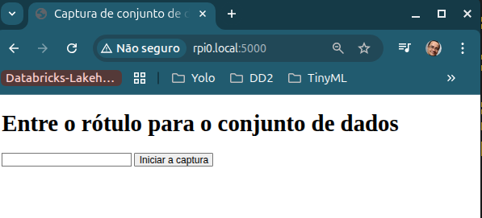
    
    4. Use a imagem ao vivo para posicionar a câmera
    5. Clique em `Capturar Imagem` para salvar uma imagem com o rótulo atual.
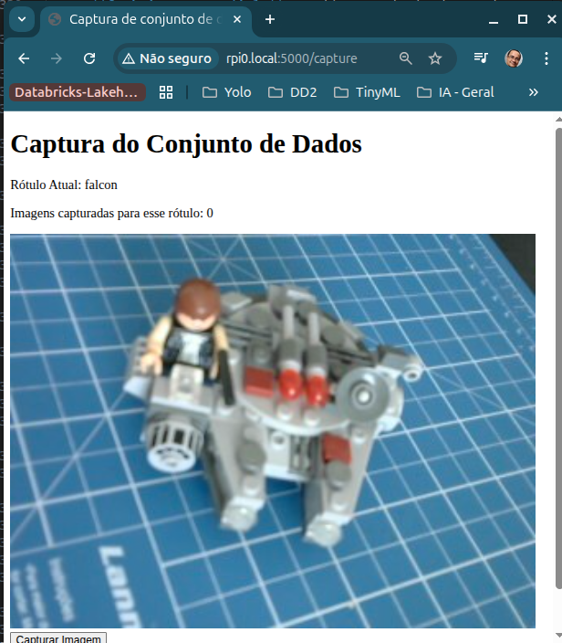    
    6. Mude os rótulos conforme necessário clicando em `Mudar o Rótulo`.
    7. Quando terminar, clique em `Parar a Captura` para encerrar e visualizar um resumo das imagens capturadas.

- Notas técnicas:
    - O script usa *threading* para lidar com a captura simultânea de quadros e o serviço web.
    - As imagens são salvas com *timestamps* de data/hora em seus nomes de arquivo para garantir a exclusividade.
    - A interface web é responsiva e pode ser acessada a partir de dispositivos móveis.
-Possibilidades de personalização:
    - Ajuste a resolução da imagem na função `initialize_camera()`. Aqui, usamos QVGA ($320 \times 240$).
    - Modifique os modelos HTML para obter uma aparência diferente.
    - Adicione etapas adicionais de processamento ou análise de imagem na função `capture_image()`.

- Número de amostras no conjunto de dados:
    - **Obtenha cerca de 60 imagens de cada categoria**. Tente capturar diferentes ângulos, fundos e condições de luz.
    - No RPi, terminaremos com uma pasta chamada dataset, que contém três subpastas, uma para cada classe de imagens.
## 3. Treinando um modelo TFLite com Edge Impulse Studio

Essa etapa do projeto é semelhante ao que você já aprendeu no roteiro de laboratório [Classificação de Imagens](https://docs.google.com/presentation/d/1zI8QhWKV3fmNJB46eiIo1tHZeL8yTCaH/edit?usp=sharing&ouid=110939560925015610214&rtpof=true&sd=true). Só que agora os dados foram capturados com uma câmera conectada ao RPi e não a um smartphone.

Portanto, usaremos o Edge Impulse Studio para treinar nosso modelo. Acesse a página do [Edge Impulse](https://edgeimpulse.com/), insira as credenciais da sua conta e crie um novo projeto.

Você pode clonar um projeto similar para sua referência: [Projeto de Classificação de Imagens na RPi com Treino no Edge Impulse](https://studio.edgeimpulse.com/public/807438/live).

Vamos percorrer quatro etapas principais usando o EI Studio (ou Studio). Essas etapas preparam o nosso modelo para uso no RPi: *Dataset*, *Impulse*, *Tests* e *Deploy* (implantação no dispositivo de borda, neste caso, o RPi).

### 3.1 O conjunto de dados (*Dataset*)
Para começar, faça o upload das imagens capturadas para o Edge Impulse Studio.

No [Studio](), siga as etapas para carregar os dados capturados:

1. Vá para a guia `Data acquisition` e, na seção `UPLOAD DATA`, carregue os arquivos do seu computador nas categorias escolhidas.
2. Deixe que o Studio divida o conjunto de dados original em treinamento e teste e escolha o rótulo 
3. Repita o procedimento para todas as três classes. No final, você deverá ver seus “dados brutos” no Studio:
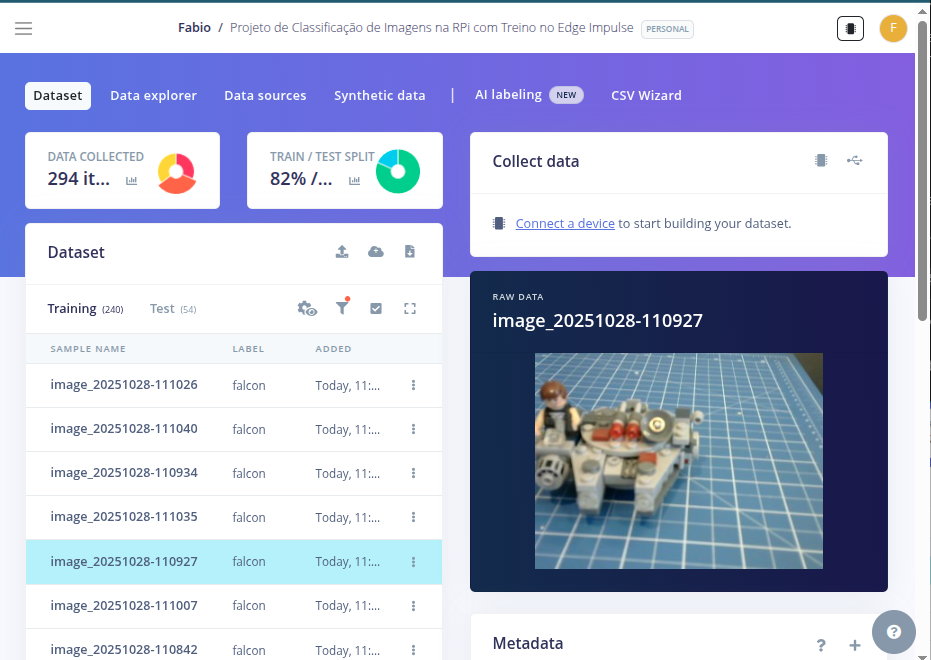

O Studio permite que você explore seus dados, mostrando uma visão completa de todos os dados do seu projeto. Você pode limpar, inspecionar ou alterar rótulos clicando em itens de dados individuais. No nosso caso, um projeto simples, os dados parecem estar corretos.
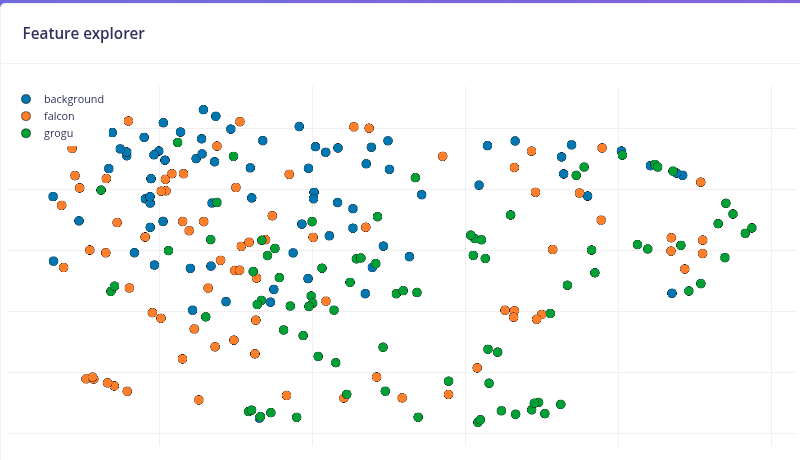

### 3.2 O Impulso (*Impulse*)
Nesta fase, devemos definir como:
- Pré-processar nossos dados, o que consiste em redimensionar as imagens individuais e determinar a profundidade de cor(*color depth*) a ser usada (seja RGB ou escala de cinza) e

- Especificar um modelo. Neste caso, será o *Transfer Learning(Images)*  para ajustar um modelo de classificação de imagens `MobileNet V2` pré-treinado em nossos dados. Esse método tem um bom desempenho mesmo com conjuntos de dados de imagens relativamente pequenos (cerca de 180 imagens no nosso caso).

O aprendizado por transferência (*Transfer Learning*) com o MobileNet oferece uma abordagem simplificada para o treinamento de modelos, o que é útil para ambientes com recursos limitados e projetos com dados rotulados limitados. O MobileNet, conhecido por sua arquitetura leve, é um modelo pré-treinado que já aprendeu recursos valiosos a partir de um grande conjunto de dados ([*ImageNet*](https://www.image-net.org/)).
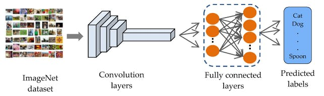
<span style="font-size:80%">
Fonte: <a href="https://mjrovai.github.io/
EdgeML_Made_Ease_ebook/" target="_blank">*EdgeML Made Easy*</a>
</span>

Ao aproveitar esses recursos aprendidos, podemos treinar um novo modelo para sua tarefa específica com menos dados e recursos computacionais e alcançar uma acurácia competitiva.
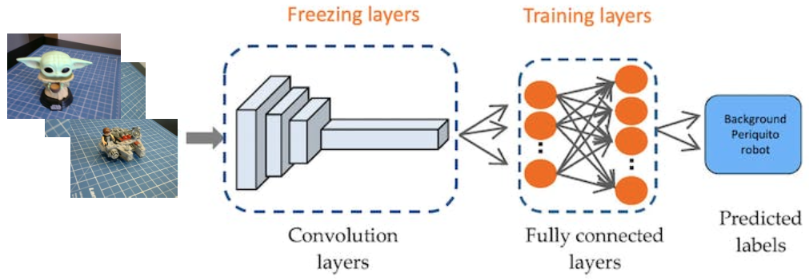

Essa abordagem reduz significativamente o tempo de treinamento e o custo computacional, tornando-a ideal para prototipagem rápida e implantação em dispositivos embarcados, onde a eficiência é fundamental.

Vá para a guia *Impulse Design* e crie o impulso, definindo um tamanho de imagem de $160 \times 160$, e um *squashing* (esmagamento de forma quadrada, sem recorte). Selecione os blocos Image (Imagem) e *Transfer Learning*. Salve o impulso.

### 3.3 Processamento da Imagem
Todas as imagens QVGA/RGB565 de entrada serão convertidas para $76.800$ recursos ($160 \times 160 \times 3$).
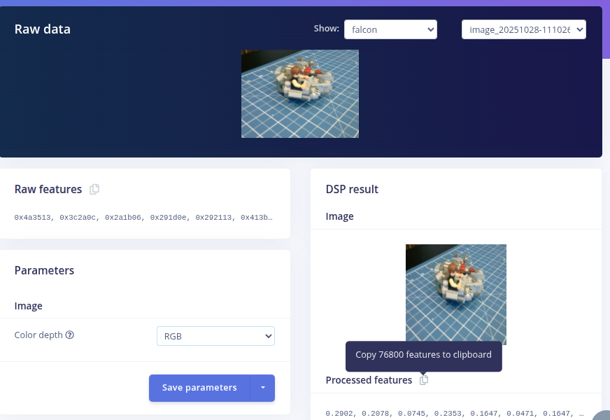 

Clique em `Generate features` para processar todas as imagens carregadas.
Em seguida, visualize os recursos extraídos na guia `Feature Explorer`.

### 3.4 Projeto do Modelo
MobileNet é uma família de redes neurais convolucionais eficientes projetadas para aplicações móveis e de visão incorporada. As principais características do MobileNet são:
1. Leveza: otimizado para dispositivos móveis e sistemas incorporados com recursos computacionais limitados.
2. Velocidade: tempos de inferência rápidos, adequados para aplicações em tempo real.
3. Acurácia: mantém boa precisão apesar de seu tamanho compacto.

O [MobileNetV2](https://arxiv.org/abs/1801.04381), lançado em 2018, aprimora a arquitetura original do MobileNet. As principais características incluem:
1. Resíduos invertidos: estruturas residuais invertidas são usadas onde conexões diretas são feitas entre camadas estreitas de gargalo.
2. Gargalos lineares: remove as não linearidades nas camadas estreitas para evitar a destruição de informações.
3. Convoluções separáveis em profundidade: continua a usar essa operação eficiente do MobileNetV1.

Em nosso projeto, faremos um `Tranfer Learning` com o `MobileNetV2 160x160 1.0`, o que significa que as imagens usadas para treinamento (e inferência futura) devem ter um tamanho de entrada de $160 \times 160$ pixels e um multiplicador de largura (*Width Multiplier*) de 1.0 (largura total, não reduzida). Essa configuração equilibra o tamanho do modelo.

### 3.5 Treinamento do Modelo
Outra técnica valiosa de aprendizado profundo é o aumento de dados (**Data Augmentation**). O aumento de dados melhora a acurácia dos modelos de aprendizado de máquina, criando dados artificiais adicionais. Um sistema de aumento de dados faz pequenas alterações aleatórias nos dados de treinamento durante o processo de treinamento (como inverter, recortar ou girar as imagens).

Olhando "por baixo do capô", aqui você pode ver como o Edge Impulse implementa uma política de aumento de dados em seus dados:
```python
# Implements the data augmentation policy
def augment_image(image, label):
    # Flips the image randomly
    image = tf.image.random_flip_left_right(image)

    # Increase the image size, then randomly crop it down to
    # the original dimensions
    resize_factor = random.uniform(1, 1.2)
    new_height = math.floor(resize_factor * INPUT_SHAPE[0])
    new_width = math.floor(resize_factor * INPUT_SHAPE[1])
    image = tf.image.resize_with_crop_or_pad(image, new_height, new_width)
    image = tf.image.random_crop(image, size=INPUT_SHAPE)

    # Vary the brightness of the image
    image = tf.image.random_brightness(image, max_delta=0.2)

    return image, label
```

A exposição a essas variações durante o treinamento pode ajudar a evitar que seu modelo tome atalhos “memorizando” pistas superficiais em seus dados de treinamento, o que significa que ele pode refletir melhor os padrões profundos subjacentes em seu conjunto de dados.

A camada densa final do nosso modelo terá 0 neurônios com uma queda de 10% para prevenção de sobreajuste. Aqui está o resultado do treinamento:
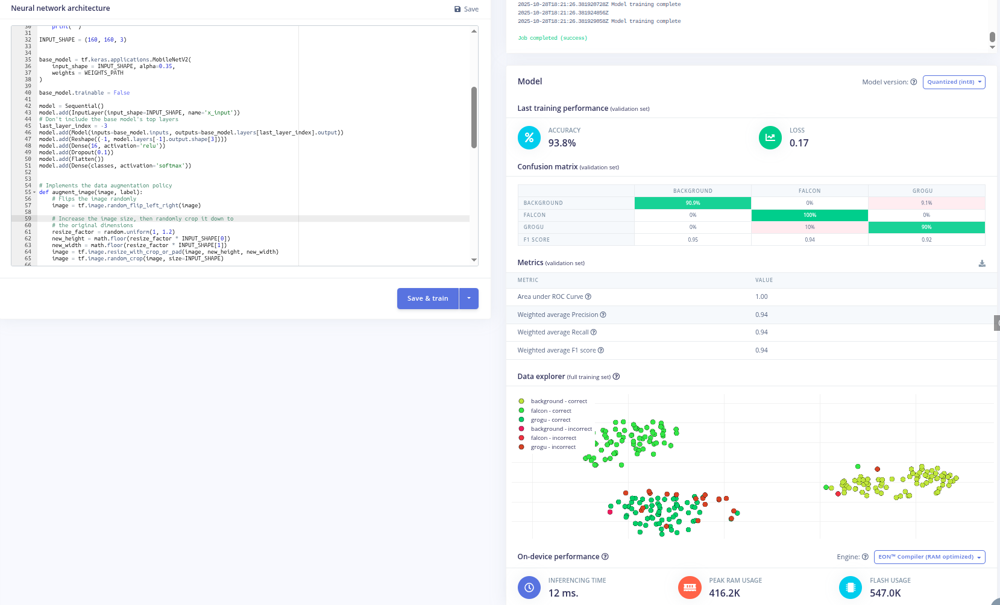


O resultado é excelente, com uma latência razoável de 12 ms (para um Raspi-4), o que deve resultar em cerca de 30 fps (*frames per second* - quadros por segundo) durante a inferência.

### 3.6 Testes do Modelo
Depois de treinar o modelo, é hora de testá-lo. Vá para a guia `Model Testing` e execute os testes para avaliar o desempenho do modelo em dados não vistos durante o treinamento. Aqui estão os resultados dos meus testes pra você comparar:
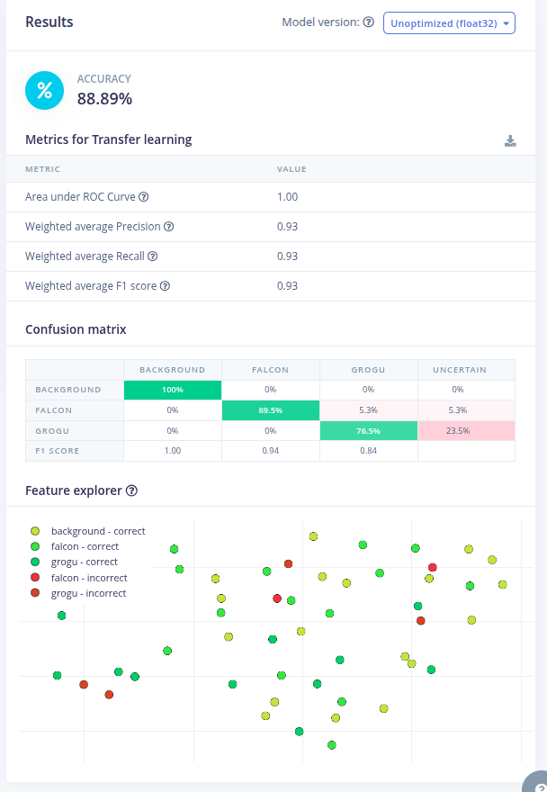

A acurácia geral é de 96,4%, o que é excelente para um modelo treinado com apenas 180 imagens. A matriz de confusão mostra que o modelo classifica corretamente a maioria das imagens, com apenas algumas confusões entre as classes `grogu` e `falcon`.

### 3.7 Implantação do Modelo no RPi
Vamos implantar o modelo treinado como `.tflite` e usar o RPi para executá-lo usando Python.

Na guia `Dashboard`, baixe os modelos *Transfer learning model* *TensorFlow Lite (int8 quantized)* e *TensorFlow Lite (float32)*  clicando no ícone de download:
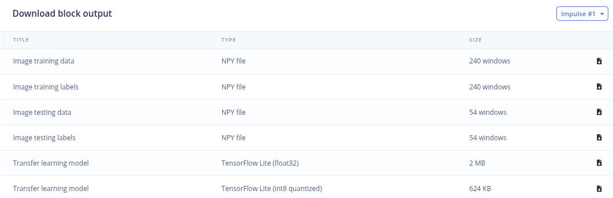

- Trafira ambos modelos para o RPi na pasta `~/Documents/TFLITE/IMG_CLASS/models/` usando o botão `Upload Files` do `Jupyter`, conforme mostrado anteriormente.

- Transfira o notebook "6_Image_Classification_edge_impulse.ipynb" no caminho `sis-emb-2025-2/aulas/sbc-rpi/rpi_img_class_tflite/docs   /6_Image_Classification_edge_impulse.ipynb` do repositório clonado para o RPi na pasta `~/Documents/TFLITE/IMG_CLASS/` usando o botão `Upload Files` do `Jupyter`, conforme mostrado anteriormente.
- Interaja com o notebook para fazer inferências com o modelo treinado no Edge Impulse e embarcado no RPi.

### 3.8 Classificação de Imagens em Tempo Real com o RPi
Vamos desenvolver um aplicativo que capture imagens com a câmera em tempo real e exiba sua classificação.

Salve o código abaixo, como [`live_infer.py`](https://github.com/fabiobento/sis-emb-2025-2/blob/main/aulas/sbc-rpi/rpi_img_class_tflite/scripts/live_infer.py) na pasta `~/Documents/TFLITE/IMG_CLASS/` do RPi:

``` python
from flask import Flask, Response, render_template_string, request, jsonify
from picamera2 import Picamera2
import io
import threading
import time
import numpy as np
from PIL import Image
import tflite_runtime.interpreter as tflite
from queue import Queue

app = Flask(__name__)

# Variáveis globais
picam2 = None
frame = None
frame_lock = threading.Lock()
is_classifying = False
confidence_threshold = 0.8
model_path = "./models/tensorflow-lite-float32-model.3.lite"
labels = ['background', 'falcon', 'grogu']
interpreter = None
classification_queue = Queue(maxsize=1)

def initialize_camera():
    global picam2
    picam2 = Picamera2()
    config = picam2.create_preview_configuration(main={"size": (320, 240)})
    picam2.configure(config)
    picam2.start()
    time.sleep(2)  #Espere a câmera estabilizar

def get_frame():
    global frame
    while True:
        stream = io.BytesIO()
        picam2.capture_file(stream, format='jpeg')
        with frame_lock:
            frame = stream.getvalue()
        time.sleep(0.1)  # Capturar frames a cada 100ms

def generate_frames():
    while True:
        with frame_lock:
            if frame is not None:
                yield (b'--frame\r\n'
                       b'Content-Type: image/jpeg\r\n\r\n' + frame + b'\r\n')
        time.sleep(0.1)

def load_model():
    global interpreter
    if interpreter is None:
        interpreter = tflite.Interpreter(model_path=model_path)
        interpreter.allocate_tensors()
    return interpreter

def classify_image(img, interpreter):
    input_details = interpreter.get_input_details()
    output_details = interpreter.get_output_details()

    img = img.resize((input_details[0]['shape'][1], input_details[0]['shape'][2]))
    input_data = np.expand_dims(np.array(img), axis=0).astype(input_details[0]['dtype'])

    interpreter.set_tensor(input_details[0]['index'], input_data)
    interpreter.invoke()

    predictions = interpreter.get_tensor(output_details[0]['index'])[0]
    # Lidar com quantização se necessário
    output_dtype = output_details[0]['dtype']
    if output_dtype in [np.int8, np.uint8]:
        # Dequantizar os resultados
        scale, zero_point = output_details[0]['quantization']
        predictions = (predictions.astype(np.float32) - zero_point) * scale
    return predictions

def classification_worker():
    interpreter = load_model()
    while True:
        if is_classifying:
            with frame_lock:
                if frame is not None:
                    img = Image.open(io.BytesIO(frame))
            predictions = classify_image(img, interpreter)
            max_prob = np.max(predictions)
            if max_prob >= confidence_threshold:
                label = labels[np.argmax(predictions)]
            else:
                label = 'Incerto'
            classification_queue.put({'label': label, 'probability': float(max_prob)})
        time.sleep(0.1)  # Ajustar conforme necessário

@app.route('/')
def index():
    return render_template_string('''
        <!DOCTYPE html>
        <html>
        <head>
            <title>Classificação de Imagens</title>
            <script src="https://code.jquery.com/jquery-3.6.0.min.js"></script>
            <script>
                function startClassification() {
                    $.post('/start');
                    $('#startBtn').prop('disabled', true);
                    $('#stopBtn').prop('disabled', false);
                }
                function stopClassification() {
                    $.post('/stop');
                    $('#startBtn').prop('disabled', false);
                    $('#stopBtn').prop('disabled', true);
                }
                function updateConfidence() {
                    var confidence = $('#confidence').val();
                    $.post('/update_confidence', {confidence: confidence});
                }
                function updateClassification() {
                    $.get('/get_classification', function(data) {
                        $('#classification').text(data.label + ': ' + data.probability.toFixed(2));
                    });
                }
                $(document).ready(function() {
                    setInterval(updateClassification, 100);  // Update every 100ms
                });
            </script>
        </head>
        <body>
            <h1>Classificação de Imagens</h1>
            
            <br>
            <button id="startBtn" onclick="startClassification()">Iniciar Classificação</button>
            <button id="stopBtn" onclick="stopClassification()" disabled>Parar Classificação</button>
            <br>
            <label for="confidence">Limite de confiança:</label>
            <input type="number" id="confidence" name="confidence" min="0" max="1" step="0.1" value="0.8" onchange="updateConfidence()">
            <br>
            <div id="classification">Aguardando por classificação...</div>
        </body>
        </html>
    ''')

@app.route('/video_feed')
def video_feed():
    return Response(generate_frames(),
                    mimetype='multipart/x-mixed-replace; boundary=frame')

@app.route('/start', methods=['POST'])
def start_classification():
    global is_classifying
    is_classifying = True
    return '', 204

@app.route('/stop', methods=['POST'])
def stop_classification():
    global is_classifying
    is_classifying = False
    return '', 204

@app.route('/update_confidence', methods=['POST'])
def update_confidence():
    global confidence_threshold
    confidence_threshold = float(request.form['confidence'])
    return '', 204

@app.route('/get_classification')
def get_classification():
    if not is_classifying:
        return jsonify({'label': 'Não classificando', 'probability': 0})
    try:
        result = classification_queue.get_nowait()
    except Queue.Empty:
        result = {'label': 'Processing', 'probability': 0}
    return jsonify(result)

if __name__ == '__main__':
    initialize_camera()
    threading.Thread(target=get_frame, daemon=True).start()
    threading.Thread(target=classification_worker, daemon=True).start()
    app.run(host='0.0.0.0', port=5000, threaded=True)

```

- No terminal execute o script:
```bash
python3 live_infer.py
``` 

- Acesse a interface web:
Abra um navegador web em seu computador desktop e acesse o endereço do RPi na porta 5000. Por exemplo:
```bash
http://rpi0.local:5000
```

O código cria uma aplicação web para classificação de imagens em tempo real utilizando um RPi, seu módulo de câmera e um modelo TensorFlow Lite. A aplicação usa o Flask para servir uma interface web onde é possível visualizar a transmissão da câmera e ver os resultados da classificação ao vivo.

- Componentes Principais
    * **Aplicação Web Flask:** Serve a interface do usuário e gerencia as requisições.
    * **PiCamera2:** Captura imagens do módulo de câmera do Raspberry Pi.
    * **TensorFlow Lite:** Executa o modelo de classificação de imagens.
    * **Threading (Multithreading):** Gerencia operações concorrentes para um desempenho fluido.

- Principais Funcionalidades
    * Exibição da transmissão da câmera ao vivo
    * Classificação de imagens em tempo real
    * Limite de confiança ajustável
    * Iniciar/Parar a classificação sob demanda

- Estrutura do Código
    * **Importações e Configuração:**
        * Flask para a aplicação web
        * PiCamera2 para o controle da câmera
        * TensorFlow Lite para a inferência
        * Threading e Queue para operações concorrentes
    * **Variáveis Globais:**
        * Gerenciamento da câmera e dos frames
        * Controle da classificação
        * Informações do modelo e dos rótulos
    * **Funções da Câmera:**
        * `initialize_camera()`: Configura a PiCamera2
        * `get_frame()`: Captura frames continuamente
        * `generate_frames()`: Fornece (yields) frames para a transmissão na web
    * **Funções do Modelo:**
        * `load_model()`: Carrega o modelo TFLite
        * `classify_image()`: Realiza a inferência em uma única imagem
    * **Worker de Classificação:**
        * Executa em uma thread separada
        * Classifica frames continuamente quando ativo
        * Atualiza uma fila (queue) com os resultados mais recentes
    * **Rotas do Flask:**
        * `/`: Serve a página HTML principal
        * `/video_feed`: Transmite o feed da câmera
        * `/start` e `/stop`: Controlam a classificação
        * `/update_confidence`: Ajusta o limite de confiança
         * `/get_classification`: Retorna o resultado da classificação mais recente
    * **Template HTML:**
        * Exibe a transmissão da câmera e os resultados da classificação
        * Fornece controles para iniciar/parar e ajustar as configurações
    * **Execução Principal:**
        * Inicializa a câmera e inicia as threads necessárias
        * Executa a aplicação Flask

- Conceitos Chave
    * **Operações Concorrentes:** Uso de threads para lidar com a captura da câmera e a classificação separadamente do servidor web.
    * **Atualizações em Tempo Real:** Atualizações frequentes dos resultados da classificação sem recarregar a página.
    * **Reutilização do Modelo:** Carregar o modelo TFLite uma única vez e reutilizá-lo para maior eficiência.
    * **Configuração Flexível:** Permitir que os usuários ajustem o limite de confiança em tempo real.

- Como Usar
    * Garanta que todas as dependências estejam instaladas.
    * Execute o script em um Raspberry Pi com um módulo de câmera.
    * Acesse a interface web de um navegador usando o endereço IP do Raspberry Pi.
    * Inicie a classificação e ajuste as configurações conforme necessário.
